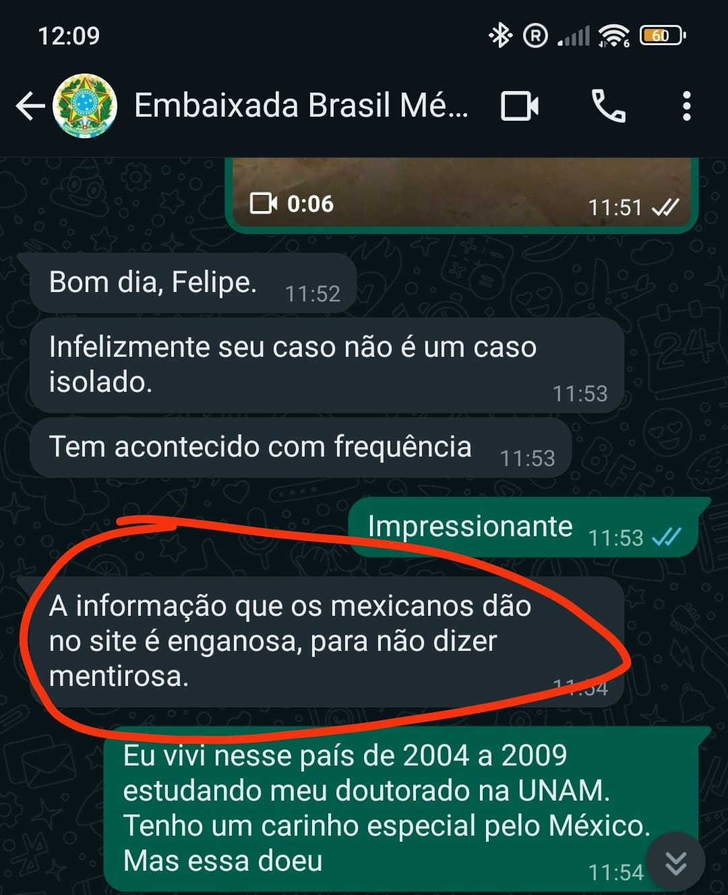

## O Contexto 

Sou cidadão brasileiro e cheguei ao México num voo proveniente do Reino Unido, onde moro legalmente há um ano com visto de [Global Talent](https://www.gov.uk/global-talent#:~:text=You%20can%20apply%20for%20a,digital%20technology), específico para trabalhos especializados em universidades, IT ou artes e quando já se tem uma carreira estabelecida e reconhecimento internacional. Estou empregado pela Nottingham Trent University atualmente e gozando de uma licença não remunerada da Universidade Federal de Pernambuco - UFPE onde trabalhei por 13 anos consecutivos. Morei no México entre 2004 e 2009 quando cursei meu doutorado em ecologia com bolsa da Capes. Desde então, voltei ao México dezenas de vezes porque mantive amizades e cooperações acadêmicas no país. Este ano, como em vários anos anteriores, aceitei o convite de um colega professor e pesquisador da UNAM para participar como professor no seu curso de campo, numa reserva onde ele mora em Yucatán. Planejei também uns dias mais para trabalhar em projetos conjuntos e preparar nossa participação num workshop que estou organizando no Kenya em junho e para o qual meu colega da UNAM foi convidado. Tudo organizado, passagem de ida e volta, carta de convite, visto inglês vigente e muita saudade do México na bagagem. 

## A confusão sobre que é visto válido

Na minha última viagem dia 26 de abril de 2024 provei o amargor de ser impedido de entrar no México por uma alegada falta de visto. As relações Brasil-México são instáveis e nos últimos 29 anos a exigência de vistos foi implantada e retirada em distintos momentos. Atualmente, os requisitos vigentes para a entrada de brasileiros no México envolve a obtenção de um visto mexicano específico ou possuir outros vistos válidos e vigentes para paises como Japão, Canadá EEUU, zona Schengen (Europa) e Reino Unido. Essa informação está cristalina no [site do governo mexicano](https://embamex.sre.gob.mx/brasil/index.php/embajada/6-servicos-consulares/servicos-consulares/189-solicitud-de-visa#:~:text=A%20partir%20de%2022%20de,voo%20com%20destino%20ao%20M%C3%A9xico.). Mas, para minha surpresa, foi detido na imigração mexicana sob alegação de não cumprir requisitos de visto. Não havia argumento possível que convencesse as autoridades migratórias em Cancún que meu ‘[biometric residence permit](https://embamex.sre.gob.mx/brasil/index.php/embajada/6-servicos-consulares/servicos-consulares/189-solicitud-de-visa#:~:text=A%20partir%20de%2022%20de,voo%20com%20destino%20ao%20M%C3%A9xico.)’ (BRP) de Global Talent era um visto válido, pois me permitia viver legalmente no Reino Unido. Aparentemente eles só consideram “visto” aquilo que se cola no passaporte e o BRP é um [cartão de ID](https://www.gov.uk/biometric-residence-permits). Cheguei a escutar da oficial de imigração que o “vignette” que tenho colado no passaporte se estivesse válido me seria permitida a entrada. Acontece que esse ‘[vignette](https://www.gov.uk/biometric-residence-permits)’ é um visto de 90 dias emitido pelo Reino Unido para entrar no país e que depois é substituído pelo BRP. Ele é parte do mesmo processo de concessão do visto de Global Talent que tem essas etapas: 1) visto de 90 dias colado no passaporte para entrar e 2) obtenção do BRP. Claramente não há clareza entre o pessoal do Instituto Nacional de Migración - INM, órgão que controla as fronteiras do México sobre o que pode ser aceito como visto válido ou não.

## A espera no aeroporto de Cancún

Impotente, assinei os papéis da minha negativa, mas nenhum documento me foi entregue. Logo tive uma amostra suave das agruras que passam imigrantes por todo o mundo. No meu caso foram apenas 24 horas, das quais umas 12h me trancaram numa cela sem mobília, só um colchão numa espécie de banco de pedra. Me foi dado comida e água, um kit de higiene e um cobertor térmico de emergência (esses que parecem papel alumínio). Os oficiais do INM não foram descorteses comigo nem rudes. Seguiam os protocolos estabelecidos. Me colocaram numa cela e meus pertences em outra cela. Quando entrei na cela, percebi que tinha porta metálica de segurança e perguntei se estava sendo preso. Me disseram que não, mas mesmo assim me trancaram nessa sala. Trazia o celular no bolso e consegui fazer umas fotos e um par de videos curtos do lugar, mas como havia câmeras, se deram conta e voltaram e me pediram para guardar o celular junto com os pertences na outra sala. Como estava só e não tinha intenção de fugir, convenci a oficial do INM que pelo menos deixasse eu ficar dormindo na cela mas com a porta destrancada. Ela aceitou. Dormi talvez umas duas horas e quando acordei saí para usar o celular (já sabia que não podia dentro da cela) e fui com o mesmo para uma sala com cadeiras onde me disseram que podia sentar e usar o celular. Tinha acontecido uma troca de turnos e outro oficial me viu e pediu que voltasse para a cela e novamente guardasse o celular. Obedeci. Daí se passaram muitas horas mas não era possível dormir pois fazia frio e a cela não possuía teto sólido, mas uma grade metálica que me permitia ouvir ruídos de todo tipo no aeroporto, incluindo furadeiras, serras e até música dos trabalhadores do aeroporto. A sala era escura e só a luz do banheiro eu podia acender. Aliás, o banheiro era decente, mas parecia que estava em reforma e não havia água na pia para lavar as mãos ou escovar os dentes nem sabão. Foram umas 12h nas quais algumas vezes gritei para que me abrissem a porta, sem sucesso. Para quem nunca foi preso, é uma sensação horrível que somada ao frio e ruídos que não deixam dormir e as mensagens de outras pessoas presas anteriormente marcadas na parede em distintas línguas, compõem um cenário de terror e até de sofrimento psicológico.

Já eram umas 7h da manhã do dia seguinte, 27 de Abril quando novamente gritei e a mesma oficial que da noite anterior me abriu a porta. Perguntei se podia usar o celular na sala com cadeiras e ela me permitiu. Sentei e comecei a postar a história no Twitter e tentar contato com a Embaixada, não foi fácil achar número para contatos de emergência e graças à postagem que começava a viralizar, consegui o contato do serviço consular. Obtive rápida resposta via whatsapp para entender que não era o único e provavelmente não seria o último para passar por isso. A embaixada confirmou ciência de que a informação propiciada pelo governo mexicano em seu site oficial é enganosa e chegou a classificá-la como mentirosa. Isso me assustou ainda mais pois ficava claro que a representação diplomática do Brasil no México está consciente das consequências disso e não age de maneira contundente. Sei que não é possível intervir no governo de outros países, mas sendo assim, deveriam pelo menos fazer um forte alerta em seu próprio site, alertar o Itamaraty ou alguma ação que alertasse os brasileiros sobre a falsidade das informações oficiais mexicanas. Realmente, esse absurdo tem se repetido de várias maneiras. A postagem do twitter trouxe relatos de outras pessoas que passaram por situação similar nos últimos 12 meses ou mais. Teve um caso, numa super coincidência, de outro pesquisador e professor brasileiro, que mora na mesma cidade que eu, Nottingham, que foi com um grupo de alunos da University of Nottingham e outros colegas professores para uma aula de campo em Yucatán, Chegando lá ele foi barrado em Cancún pelo mesmo motivo que eu. Ele reconheceu a porta da cela, pois ficou na mesma. Ou seja, isso tem acontecido frequentemente e considero inaceitável que a representação diplomática brasileira não atue de forma alguma. Não espero que a embaixada tenha poder para modificar nada das leis mexicanas, não se trata disso. Mas, é possível emitir alertas de viagem para países onde a situação é de risco para seus cidadãos. Esse me parece ser o caso do México neste momento para brasileiros. Já se passavam mais de 24 horas até que um oficial mal-encarado do INM aparecesse dando-me ordens de levantar e acompanhá-lo. Com meu passaporte na mão, acompanhado de outro funcionário da mesma empresa de segurança privada, eles me escoltaram até o avião para onde o oficial me ordena entrar e com celular em mãos, me devolve o passaporte, filmando o ato. Disse-lhe ‘gracias’.

## As lições

Mesmo preso no aeroporto, tive a sorte de conhecer Doña Lupe, funcionária de uma empresa de segurança privada terceirizada pela companhia aérea que me trouxe, ela era minha “custódio’ no dia seguinte. Seu trabalho era me “vigiar” e me trazer comida e água que eram responsabilidade da companhia aérea que me trouxe ao México, a British Airways. Doña Lupe me contou toda sua vida, com seu lindo sotaque de campsina tabasqueña que havia imigrado para a opulenta Cancún em busca de trabalho. Mesmo preso, ela me arrancou risadas e me emocionou com seus relatos de mulher do campo mexicana que casou tarde (22 anos) e tinha medo de “quedar para vestir santos”, expressão equivalente a “ficar para tia” em português. Vida comum, de mãe solteira, lutadora, sofrida e cheia de orgulho como a de 100% dos mexicanos que conheci na vida. As horas passaram rápido com Doña Lupe e nos despedimos com uma abraço quando ela finalmente tinha que trocar de turno. “Cúidese mucho, muchacho. Que Dios le bendiga y que le permita volver a México.” me dice. 

Agora eu definitivamente entendi. Nem todos são iguais. Alguns passaportes podem nos abrir o mundo e permitem que se use catracas eletrônicas onde é só escanear o passaporte e “abracadabra” nem precisa falar com oficiais de fronteira. Já outros, transformam seus portadores em pessoas indesejáveis. Lembrei também que aprendi a respeitar os imigrantes justamente vivendo num país que tem uma importante fração de sua população economicamente ativa vivendo nos EEUU. Foi morando no México entre 2004 e 2009 que conheci as notícias de maus tratos que imigrantes centroamericanos pela polícia mexicana, expondo um paradoxo cruel, o de devolver com doses de crueldade a quem julgamos pior que nós o mesmo tratamento que recebemos de quem se julga melhor que nós. O México é um pesadelo para imigrantes, seguramente porque sofre o pesadelo de ser imigrante. A pedagogia do oprimido de Paulo Freire toma contornos de realidade distópica no México. Lembrei também de uma exposição que vi no Museu de las Culturas Populares em Coyoacán na Cidade do México em 2005. Começava por um mapa com a dispersão dos seres humanos pelo planeta desde que o primeiro ser humano apareceu na Terra. A ideia era convencer o visitante de que se mover pelo mundo é da própria condição humana e que isso não torna ninguém ilegal, a exposição mudou meu vocabulario e nunca chamar ninguém de “ilegal” mas de no máximo “indocumentado”, porque pessoas não são ilegais e a falta de documentos não torna ninguém indesejável. Essa contradição mexicana foi a que escolhi para tatuar nas costas quando deixei de viver lá em 2009. Havia lido uma crônica que acredito ter sido escrita por Carlos Monsivais (mas não tenho certeza) onde se usava a deusa azteca [Coyolxauqui](https://www.worldhistory.org/trans/pt/1-14393/coyolxauhqui/) para fazer um paralelo com México e a América Latina em geral. A famosa imagem da deusa, desmembrada e esquartejada pelo seu próprio irmão, Huitzilopochtli, por tentar matá-lo era a própria América Latina, maltratada, apartada, odiosa e odiada pelos pelos irmãos. Cabeça, corpo e membros separados atuando de maneira paradoxal. 

Amo o México, amo seu povo e sua natureza. Tenho México tatuado no meu corpo na forma de um mapa no braço e uma deusa azteca nas costas. Continuarei amando este lugar do planeta que considero minha segunda casa e adorando sua gente, que sempre me acolheu tão amavelmente. Até a próxima, México.

 

Acima imagens da cela e da conversa com a representação consular brasieira no México onde sugerem ter consciência da informação mentirosa no site do governo mexicano.

