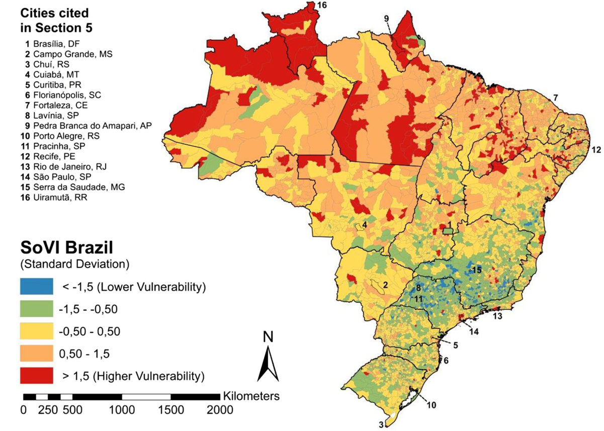
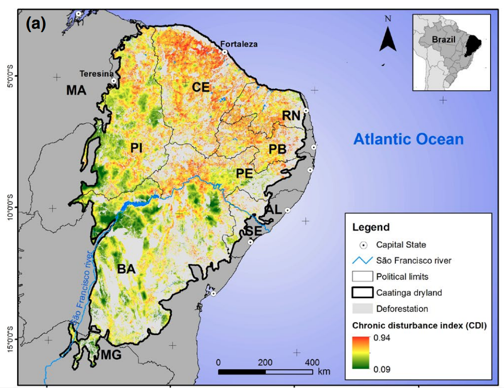
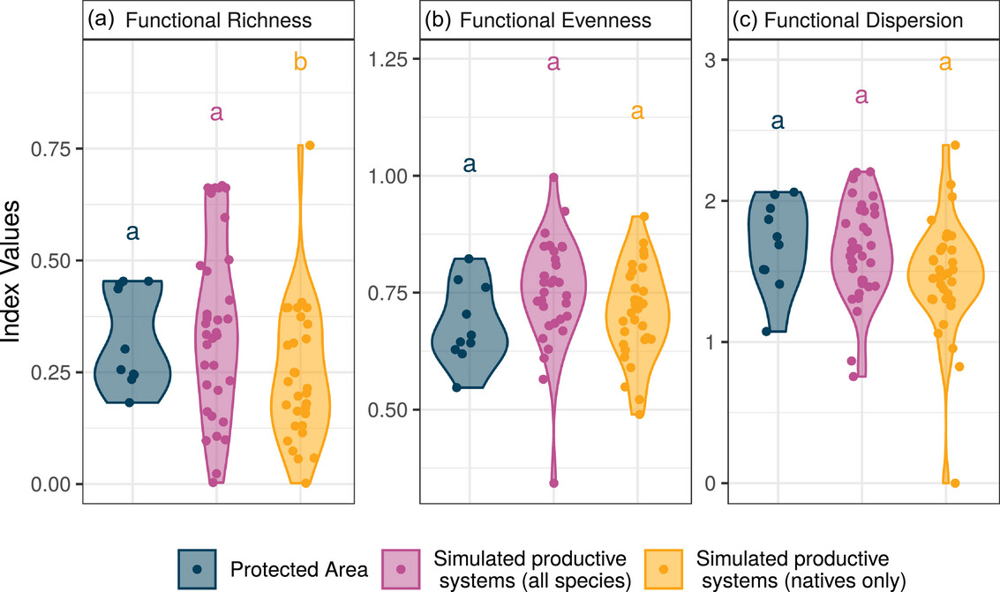
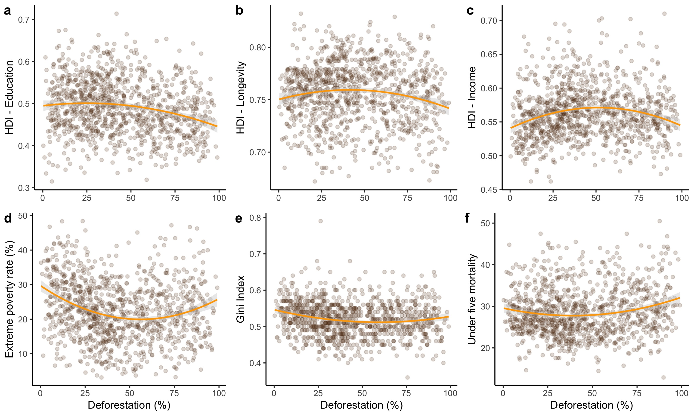
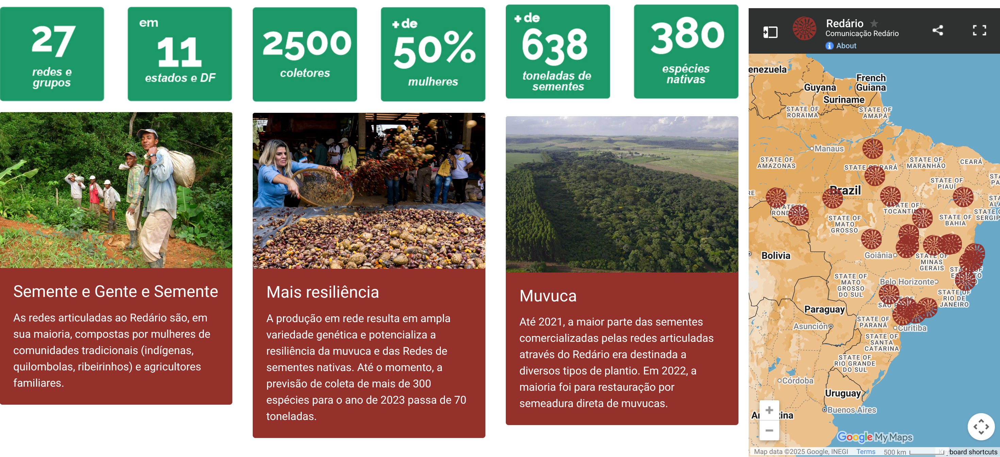
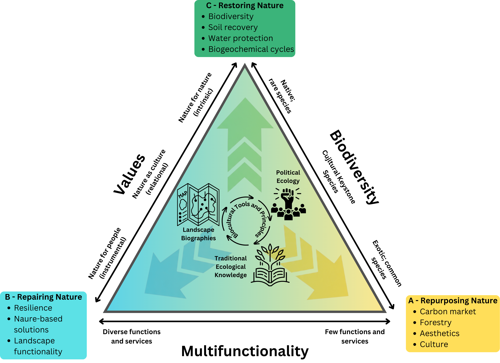

## {background-image="libs/caat_verde.jpg" background-size="cover" background-position="center" .center .middle}

## {background-image="libs/caat_seca.jpg" background-size="cover" background-position="center" .center .middle}

## {background-image="libs/caat_verde2.jpg" background-size="cover" background-position="center" .center .middle}

## {background-image="libs/caat_seca2.jpg" background-size="cover" background-position="center" .center .middle}

## {background-image="libs/lear.jpg" background-size="cover" background-position="center" .center .middle}

## {background-image="libs/tatu2.png" background-size="cover" background-position="center" .center .middle}

## {background-image="libs/vaqueiro.png" background-size="cover" background-position="center" .center .middle}

## {background-image="libs/pessoas.png" background-size="cover" background-position="center" .center .middle}

## A paisagem socioecológica Caatinga

Grupos sociais vulneráveis
[Hummel 2016](Social Vulnerability to Natural Hazards in Brazil)

## {background-image="libs/mapbiom_caat.jpg" background-size="cover" background-position="center" .center .middle}

## {background-image="libs/desmat_caat.jpg" background-size="cover" background-position="center" .center .middle}

## Ecologia política da restauração
::: columns
::: {.column width="45%"}

- Reconhecer os atores afetados
- Combater desigualdades
- Valorizar conhecimentos locais
- Recuperar/Conservar a diversidade socioecológica

:::

::: {.column width="55%"}

:::
:::

## {background-image="libs/roca_caat.jpg" background-size="cover" background-position="center" .center .middle}

## Perturbação Crônica

[Antongiovanni et al (2020)](https://besjournals.onlinelibrary.wiley.com/doi/full/10.1111/1365-2664.13686)

## Bodes e Caatinga (Herbivoria)

:::{columns}
:::{.column}

- Áreas de uso de 100ha
- Hábito generalista
- Reduzem biomassa de herbáceas
- Preferência por hábitats abertos

:::

:::{.column}

:::
:::

fontes: [Jamelli et al 2021](https://www.sciencedirect.com/science/article/abs/pii/S0140196321000987) e [Menezes et al 2020](https://onlinelibrary.wiley.com/doi/epdf/10.1002/ldr.3693)

## Respostas da Vegetação ao Clima e Fertilidade

## Respostas da Vegetação ao Clima e Fertilidade

## {background-image="libs/drone.png" background-size="cover" background-position="center" .center .middle}

## Invasão Biológica vs. Comunidade de Plantas

Modifica a composição taxonômica

## Estratégia fucnional das plantas da neo-Caatinga

## {background-image="libs/homen_caatinga.jpg" background-size="cover" background-position="center" .center .middle}

## {background-image="libs/wef.png" background-size="90%"}

## Cultural Keystone Species

::::{.columns}

:::{.column width="50%"}
:::{.nonincremental}

- 12% of the Caatinga flora cover 53% of the traditional values 
- Multiple benefits (food, health, etc...)
- Preserves phylogenetic diversity

:::
:::

:::{.column width="50%"}

{width=120%}

:::
:::

## 

{fig-align=center, width=95%}

##

{fig-align=center, width=95%}

## Towards a Biocultural Restoration{.center}

## Landscapes are live

{fig-align="center" width="120%"}

Alencar et al (under review)

## Political Ecology

{fig-align="center" width="120%"}

## Political Ecology

{fig-align=center, width=95%}

Alencar et al (2025)

## Traditional Ecological Knowledge

{fig-align="center" width="120%"}

{.absolute top=550}

## Biocultural Restoration

{fig-align="center"}

## {background-image="libs/otromundo.jpg" background-size="contain"}

# Obrigado

felipe.plmelo@ufpe.br

{fig-align=center width=35%}

