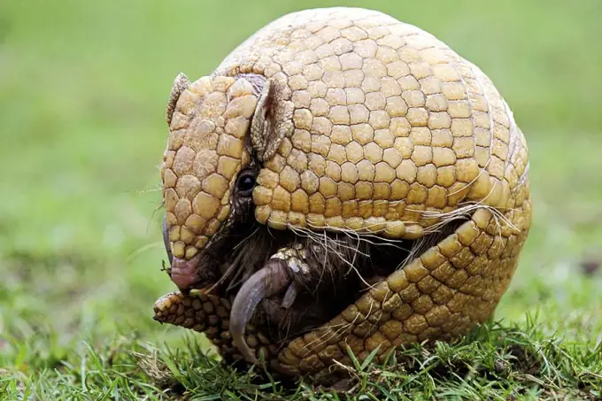
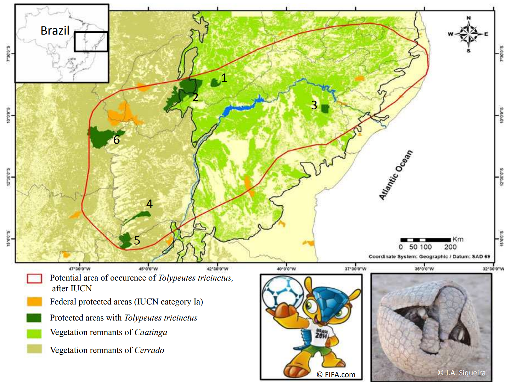
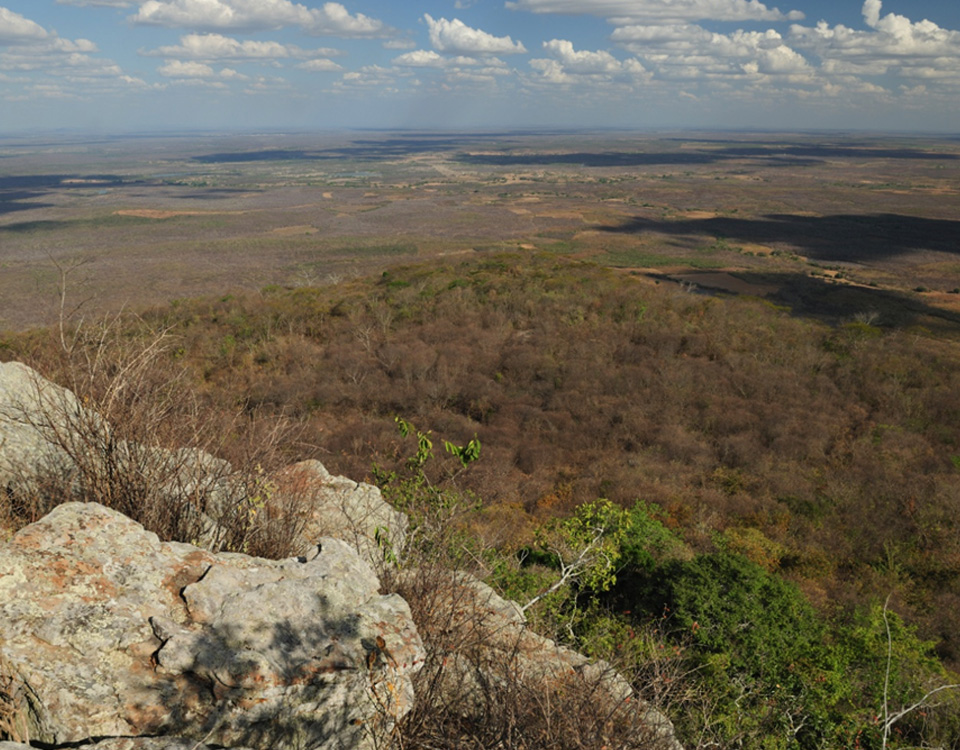
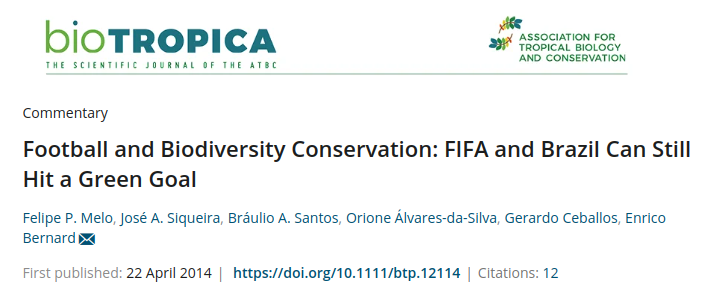
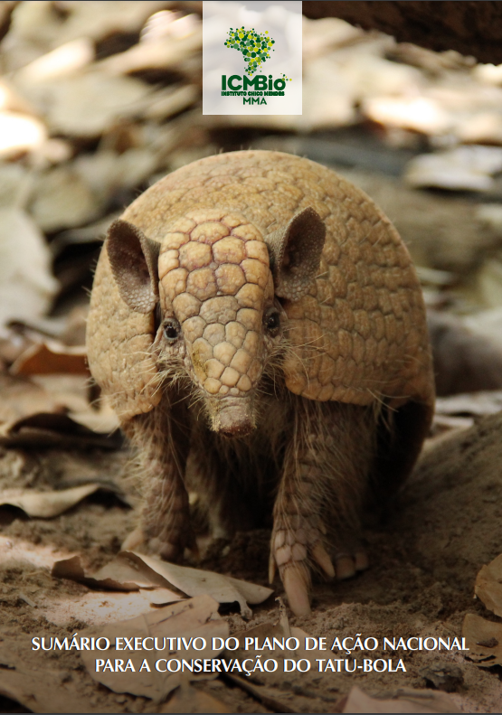
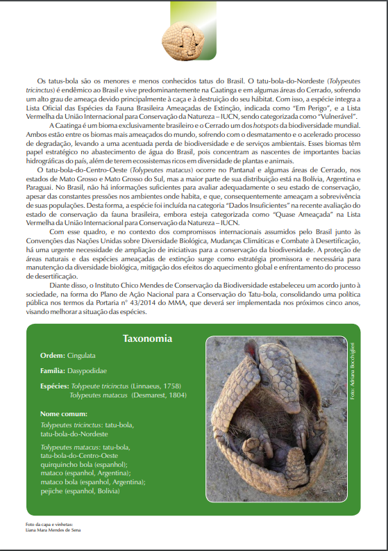
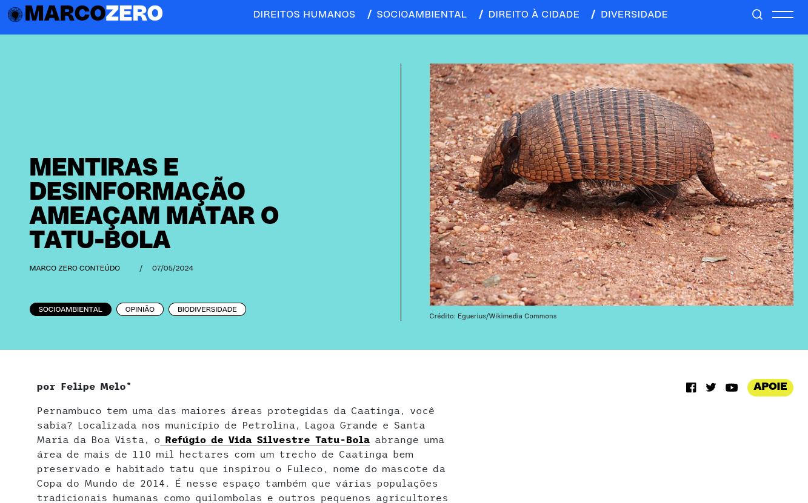

## 2014 Copa do Mundo da FIFA

### A vergonha

## A oportunidade

:::: {.columns}

::: {.column width="50%"}

Fuleco = **Fu**tebol + **Eco**logia

:::

::: {.column width="50%"} 

 

:::

::::

## *Tolypeutes tricinctus*

## Caatinga

:::: {.columns}

::: {.column width="50%"} 

Hyper-diverse tropical dry forest

:::

::: {.column width="50%"}

-   < 5% declarado como AP (em 2014)
-   Muita probreza econômica
-   Alta dependência de recursos naturais

:::

::::

## O Desafio

:::: {.columns}

::: {.column width="60%"}

1 - Plano de ação para o Tatu-Bola

2 - Cumprir o investimento anunciado para o "Parques da Copa"

3 - Criar 1mil ha de AP para cada gol marcado

:::

::: {.column width="40%"}

:::

::::

## Tatu-bola 1 x 0 Ameaças

:::: {.columns}

::: {.column width="60%"}

:::

::: {.column width="40%"}

:::

::::

## Tatu-bola 1 x 1 Ameaças

:::: {.columns}

::: {.column width="60%"}

:::

::: {.column width="40%"}

:::

::::

### Brasil investe apenas R$ 1.02 por hectare de área protegida

## Tatu-bola 2 x 1 Ameaças

:::: {.columns}

::: {.column width="60%"}

:::

::: {.column width="40%"}

-   110k hectares RVS Tatu-Bola
-   Criado à partir de um trabalho intenso, rápido e inclusivo

:::

::::

## O jogo ainda não acabou

### Conflitos permanentes

## O jogo ainda não acabou

### Conflitos permanentes

## 

<iframe width="1128" height="635" src="https://www.youtube.com/embed/rQHAgyrXims" title="O gol do Tatu-bola (The armadillo&#39;s goal)" frameborder="0" allow="accelerometer; autoplay; clipboard-write; encrypted-media; gyroscope; picture-in-picture; web-share" allowfullscreen>

</iframe>

##

## Fim?
