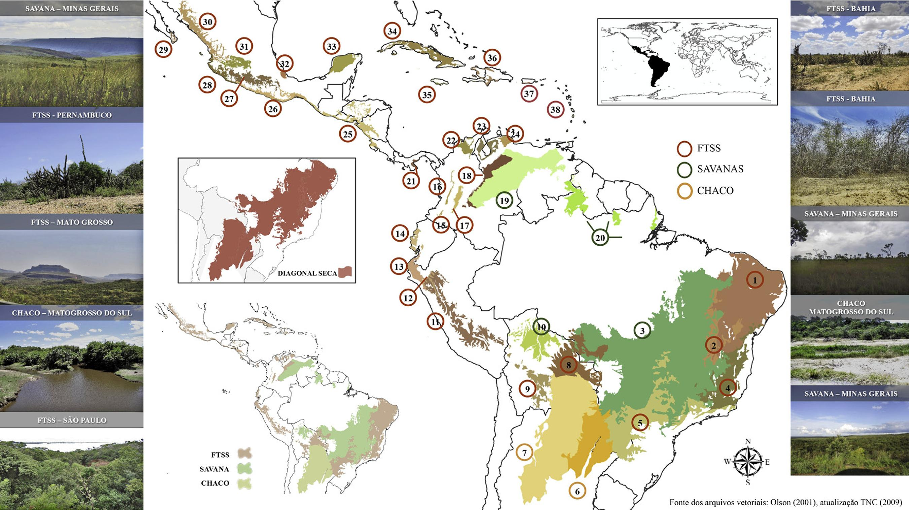
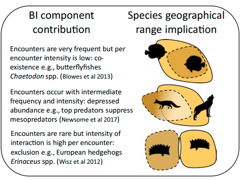
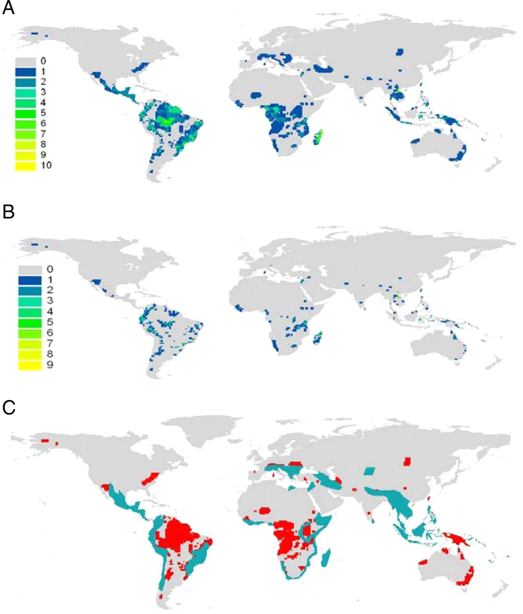

```{r setup}
library(tidyverse)
```

## O que precisamos saber hoje?

::: {.columns}
::: {.column width="50%"}
- Como a biodiversidade se organiza espacial e temporalmente na Terra
- Como usar essas informações para desenhar estratégias de conservação
- Aprender um pouco de Biogeografia
:::
::: {.column width="50%"}
{height=300}
:::
:::

---

## A história da biodiversidade

{height=500}

---

## Vivemos o período mais Biodiverso da Terra

::: {.columns}
::: {.column width="50%"}
{height=500}
:::
::: {.column width="50%"}
Mas não foi suave...

Houve muitas extinções EM MASSA

Mas a vida continuou prosperando

:::
:::

---

## {.center}

> ## A vida na Terra hoje é o resultado de 4,5 bilhões de anos de evolução, especiação, extinção e dispersão

---

## Fronteiras biológicas da Terra

[**Províncias biogeográficas**](https://en.wikipedia.org/wiki/Biogeographic_realm)


---

## A biodiversidade tem preferências


---

## A biodiversidade tem preferências

### No mar [(mamíferos)](https://journals.plos.org/plosone/article?id=10.1371/journal.pone.0019653)


---

## A própria árvore da vida é bastante desigual

{height=500}

---

## Padrões e mais padrões

::: {.columns}
::: {.column width="50%"}


[Purvis & Hector (2000)](https://www.nature.com/articles/35012221)
:::
::: {.column width="50%"}
### Esse padrão aninhado acontece em todos os níveis de vida


:::
:::

---

## {.center}

# E continua...

---

## Qual o nosso nível de conhecimento sobre a biodiversidade entre clados?

::: {.columns}
::: {.column width="50%"}
{height=400}

[Purvis & Hector (2000)](https://www.nature.com/articles/35012221)
:::
::: {.column width="50%"}
{width=60%}
:::
:::

---

## Alfred Russell Wallace

::: {.columns}
::: {.column width="50%"}
{height=500}
:::
::: {.column width="50%"}
Considerado o fundador da Biogeografia


[Leitura recomendada: Darwin, historical biogeography, and the importance of overcoming binary opposites](https://onlinelibrary.wiley.com/doi/full/10.1111/j.1365-2699.2009.02111.x)
:::
:::

---

## Biodiversidade em ilhas

::: {.columns}
::: {.column width="50%"}
- Relação espécie-área
- Nicho ecológico
- Ecologia vs. História
- Interação entre espécies
:::
::: {.column width="50%"}

:::
:::

---

## Relação espécie-área

O número de espécies aumenta com a área amostrada

::: {.columns}
::: {.column width="50%"}
### Linear

```{r}
#| out-width: "70%"
spe_area <- tibble(
  area    = 10:1000,
  spe_lin = area / 3
)
spe_area |>
  ggplot(aes(x = area, y = spe_lin)) +
  geom_point()
```


:::
::: {.column width="50%"}
### Exponencial

```{r}
#| out-width: "70%"
spe_area_exp <- tibble(
  area    = 10:1000,
  spe_exp = ((area * 100000)^0.1)
)
spe_area_exp |>
  ggplot(aes(x = area, y = spe_exp)) +
  geom_point()
```
:::
:::

---

## Nicho ecológico ou biogeografia ecológica

::: {.r-stack}
{height=500}
:::

---

## Biogeografia Histórica




[Caracterização e história biogeográfica dos ecossistemas secos neotropicais](https://en.wikipedia.org/wiki/Species%E2%80%93area_relationship)

---

## Interação entre espécies

::: {.r-stack}
{height=500}
:::

---

## Biogeografia de ilhas

::: {.columns}
::: {.column width="50%"}
{height=400}

[Biogeografia de ilhas em PT-BR](http://recologia.com.br/2016/06/09/biogeografia-de-ilhas/)
:::
::: {.column width="50%"}


[Biogeografia de Ilhas no Wikipedia](https://en.wikipedia.org/wiki/Insular_biogeography)
:::
:::

---

## Tipos de raridade

::: {.r-stack}

:::

[Rabinowitz's (1981)](https://www.esf.edu/efb/parry/Invert_Cons_14_Readings/Rabinowitz_1981.pdf)

---

## Aplicações na conservação da biodiversidade

::: {.columns}
::: {.column width="50%"}
{height=500}
:::
::: {.column width="50%"}
**A** = Riqueza

**B** = Endemismo

**C** = Novas espécies

[Discoveries of new mammal species and their implications for conservation and ecosystem services](https://www.pnas.org/content/106/10/3841)
:::
:::

---

## Aplicações na conservação da biodiversidade

::: {.columns}
::: {.column width="50%"}
{height=400}

[Medellín & Soberon 2008](https://conbio.onlinelibrary.wiley.com/doi/abs/10.1046/j.1523-1739.1999.97315.x)
:::

. . .

::: {.column width="50%"}

:::
:::

---

## Aplicações na conservação da biodiversidade

::: {.r-stack}

:::

[Brooks et al 2006](https://science.sciencemag.org/content/313/5783/58)

---

## {.center}

# FIM
