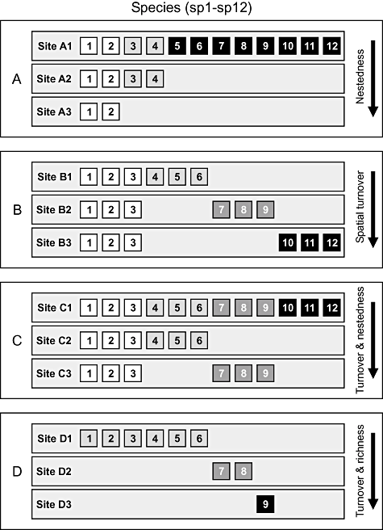
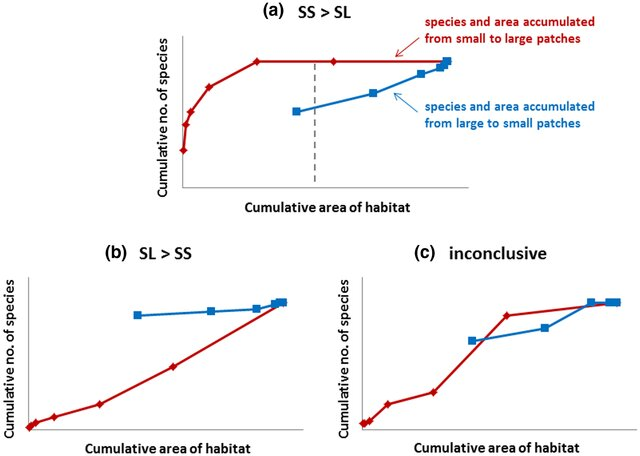
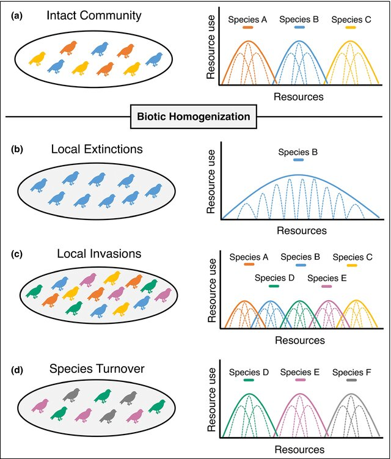

```{r setup, include=FALSE}
library(tidyverse)
library(vegan)
library(ggplot2)
library(patchwork)
```

# Diversidade no Espaço {background-color="#1a4a2e"}
## Heterogeneidade Espacial

---

## 

> **Heterogeneidade espacial** é a variação nas condições ambientais, na estrutura do habitat e na composição de recursos ao longo do espaço geográfico.

:::: {.columns}
::: {.column width="55%"}
- Variação abiótica (clima, solo, topografia)
- Variação biótica
- Distribuição de recursos
- Histórico de perturbações

:::
::: {.column width="45%"}


:::
::::

::: {.callout-note}
**Hipótese da heterogeneidade do habitat**: ambientes mais heterogêneos sustentam maior diversidade de espécies.
:::

---

## Por que a diversidade varia no espaço?

| Fator | Escala | Mecanismo |
|-------|--------|-----------|
| Clima  | Regional/global | Limita fisiologia e produtividade |
| Topografia | Local/regional | Cria microclimas e barreiras |
| Tipo de solo | Local | Filtra espécies por nutrição |
| Perturbação | Local/regional | Abre/fecha nichos |
| Área | Regional/global | Efeito área-espécies |
| Isolamento | Regional/global | Dispersão e imigração |

---

## 
>**Gradiente latitudinal de diversidade** — o padrão mais robusto em ecologia

:::: {.columns}
::: {.column width="50%"}


:::
::: {.column width="50%"}
**Hipóteses explicativas:**

1. Produtividade / energia disponível
2. Área e tamanho dos biomas
3. Estabilidade climática histórica
4. Maior tempo de evolução (tropicais)
5. Diferenças em taxas de especiação/extinção
:::
::::

::: {.callout-important}
Não há consenso sobre uma única causa — múltiplos fatores atuam em conjunto!
:::

---

## Heterogeneidade x Diversidade
:::{.columns}
:::{.column}

- Habitats complexos = **mais nichos ecológicos**
- Maior número de microambientes → maior partição de recursos

:::

:::{.column}

```{r heterogeneidade-plot}
#| echo: false
set.seed(42)
heterog <- seq(1, 10, by = 0.5)
riqueza <- 5 + 3.5 * log(heterog) + rnorm(length(heterog), 0, 1.5)
df <- data.frame(heterog, riqueza)
ggplot(df, aes(x = heterog, y = riqueza)) +
  geom_point(color = "#2d6a4f", size = 3, alpha = 0.8) +
  geom_smooth(method = "lm", formula = y ~ log(x),
              color = "#52b788", fill = "#95d5b2", alpha = 0.3) +
  labs(x = "Índice de Heterogeneidade do Habitat",
       y = "Riqueza de Espécies",
       title = "Heterogeneidade × Diversidade Local") +
  theme_classic(base_size = 13)
```
:::
:::
- Florestas tropicais: estratificação vertical
- Recifes de coral: complexidade tridimensional

---

## Relação Espécies–Área

Uma das relações mais importantes em ecologia de comunidades:

$$S = c \cdot A^z$$

:::: {.columns}
::: {.column width="55%"}
- **S** = número de espécies
- **A** = área do habitat
- **c** = constante (intercepto)
- **z** = inclinação (0,1–0,35 para ilhas oceânicas; 0,12–0,18 para fragmentos continentais)

:::
::: {.column width="45%"}


:::
::::

# Diversidade α, β e γ: As Três Componentes da Diversidade {background-color="#1a3a5c"} 

---

## O Framework de Whittaker

Robert Whittaker propôs a **partição da diversidade** em três escalas hierárquicas:

```
┌─────────────────────────────────────┐
│         DIVERSIDADE GAMA (γ)        │  ← Paisagem / Região
│  ┌────────────┐   ┌────────────┐    │
│  │  Comunid. 1│   │  Comunid. 2│    │
│  │  α = 8 sp  │↔β↔│  α = 6 sp  │    │  ← β entre comunidades
│  └────────────┘   └────────────┘    │
│        Diversidade Local (α)        │
└─────────────────────────────────────┘
```

:::: {.columns}
::: {.column width="33%"}
**Alfa (α)**
Diversidade *dentro* de um local (comunidade local)
:::
::: {.column width="33%"}
**Beta (β)**
Diversidade *entre* locais (turnover de espécies)
:::
::: {.column width="33%"}
**Gama (γ)**
Diversidade *total* da região
:::
::::

---

## Diversidade Alfa (α)

> **Diversidade alfa** é a diversidade de espécies em uma escala local, dentro de um único habitat ou comunidade.

**Medidas de diversidade α:**

| Medida | O que captura | Fórmula |
|--------|--------------|---------|
| Riqueza (S) | Apenas número de espécies | $S$ |
| Shannon (H') | Riqueza + equitabilidade | $-\sum p_i \ln p_i$ |
| Simpson (D) | Dominância | $1 - \sum p_i^2$ |
| Chao1 | Riqueza estimada (rarefação) | $\hat{S} = S_{obs} + \frac{n_1^2}{2n_2}$ |

::: {.callout-tip}
Diversidade α responde a perguntas como: *"Quão diversa é esta floresta?"* ou *"Quantas espécies coexistem neste trecho de rio?"*
:::

---

## Diversidade Gama (γ)

> **Diversidade gama** é a diversidade total de uma região ou paisagem, integrando todos os locais amostrados.

**Relação fundamental:**

$$\gamma = \alpha \times \beta$$

- **γ alta + α alta** → habitats ricos, baixa substituição entre eles
- **γ alta + α baixa** → habitats pobres individualmente, mas compostos por espécies muito diferentes
- **γ baixa + α baixa** → região com poucos espécies, habitats similares

::: {.callout-note}
A diversidade gama depende tanto da diversidade local (α) quanto da diferenciação entre comunidades (β).
:::

---

## Diversidade Beta (β) — Introdução

> **Diversidade beta** mede a **variação na composição de espécies** entre diferentes locais ou ao longo de gradientes ambientais.

**Por que β é central em ecologia de comunidades?**

- Explica como a diversidade regional é montada a partir de comunidades locais
- Reflete processos de dispersão, filtragem ambiental e interações bióticas
- Ferramenta fundamental para detectar **gradientes ecológicos**
- Base para planejamento de unidades de conservação complementares

## Duas interpretações de β
:::{.columns}
:::{.column}

1. **Turnover**: substituição de espécies ao longo de gradientes 
2. **Variação**: heterogeneidade multivariada na composição de espécies 
:::
:::{.column}



:::
:::
# Medidas de Diversidade: Índices Clássicos vs. Números de Hill {background-color="#3d1a5c"}


---

## O Problema dos Índices Clássicos

Índices como H' (Shannon) e D (Simpson) **não são diretamente comparáveis** entre si:

```{r indices-problema, echo=FALSE, fig.height=3.8}
# Comunidades com mesma riqueza, diferente equitabilidade
comm_eq <- c(10, 10, 10, 10, 10)   # equitativa
comm_dom <- c(46, 1, 1, 1, 1)       # dominada

H_eq  <- -sum((comm_eq/sum(comm_eq)) * log(comm_eq/sum(comm_eq)))
H_dom <- -sum((comm_dom/sum(comm_dom)) * log(comm_dom/sum(comm_dom)))

D_eq  <- 1 - sum((comm_eq/sum(comm_eq))^2)
D_dom <- 1 - sum((comm_dom/sum(comm_dom))^2)

df_idx <- data.frame(
  Comunidade = rep(c("Equitativa", "Dominada"), 2),
  Índice = c("Shannon (H')", "Shannon (H')", "Simpson (1-D)", "Simpson (1-D)"),
  Valor = c(H_eq, H_dom, D_eq, D_dom)
)

ggplot(df_idx, aes(x = Comunidade, y = Valor, fill = Comunidade)) +
  geom_col(width = 0.6) +
  facet_wrap(~Índice, scales = "free_y") +
  scale_fill_manual(values = c("#7b2d8b", "#c77dff")) +
  labs(title = "Dois índices, mesmas comunidades — escalas diferentes!",
       y = "Valor do Índice", x = "") +
  theme_classic(base_size = 12) +
  theme(legend.position = "none")
```

::: {.callout-warning}
Shannon e Simpson medem conceitos similares, mas em **escalas não comparáveis**. Como somar ou comparar diretamente?
:::

---

## Números de Hill — A Solução Elegante

Mark Hill (1973) propôs uma **família unificada de medidas de diversidade**:

$$^{q}D = \left(\sum_{i=1}^{S} p_i^q \right)^{\frac{1}{1-q}}$$

Onde **q** é a **ordem da diversidade** — controla o peso dado às espécies raras vs. abundantes:

##  Explicando


| Ordem q | Medida equivalente | Interpretação |
|-----------|-------------------|---------------|
| q = 0 | Riqueza (S) | Div spp raras |
| q → 1 | exp(H') — exponencial de Shannon | Div spp comuns |
| q = 2 | 1/D (inverso de Simpson) | div spp dominantes |


---

## Interpretação dos Números de Hill

> Os números de Hill expressam diversidade em **"número efetivo de espécies"** — quantas espécies igualmente abundantes teriam a mesma diversidade que a comunidade observada.

```{r hill-plot, echo=FALSE, fig.height=4}
hill_number <- function(p, q) {
  p <- p[p > 0]
  if (abs(q - 1) < 1e-10) {
    exp(-sum(p * log(p)))
  } else {
    sum(p^q)^(1/(1-q))
  }
}

q_vals <- seq(0, 3, by = 0.1)
comm_eq  <- rep(1/10, 10)
comm_dom <- c(0.55, 0.15, 0.10, 0.08, 0.05, 0.03, 0.02, 0.01, 0.005, 0.005)
comm_mid <- c(0.25, 0.20, 0.15, 0.12, 0.10, 0.07, 0.05, 0.03, 0.02, 0.01)

df_hill <- data.frame(
  q = rep(q_vals, 3),
  D = c(sapply(q_vals, hill_number, p = comm_eq),
        sapply(q_vals, hill_number, p = comm_dom),
        sapply(q_vals, hill_number, p = comm_mid)),
  Comunidade = rep(c("Equitativa", "Dominada", "Intermediária"), each = length(q_vals))
)

ggplot(df_hill, aes(x = q, y = D, color = Comunidade, linetype = Comunidade)) +
  geom_line(linewidth = 1.2) +
  scale_color_manual(values = c("#e76f51", "#2a9d8f", "#7b2d8b")) +
  labs(x = "Ordem q", y = "Número de Hill (ᵍD)",
       title = "Perfis de diversidade (Hill numbers)",
       subtitle = "Todas as curvas começam com S = 10 espécies") +
  geom_vline(xintercept = c(0,1,2), linetype = "dashed", alpha = 0.4) +
  annotate("text", x = 0.05, y = 10.5, label = "q=0\n(Riqueza)", size = 3) +
  annotate("text", x = 1.05, y = 10.5, label = "q=1\n(Shannon)", size = 3) +
  annotate("text", x = 2.05, y = 10.5, label = "q=2\n(Simpson)", size = 3) +
  theme_classic(base_size = 12)
```

---

## Princípio do dobramento

> Se uma comunidade é dividida em dois grupos igualmente abundantes e sem espécies em comum, o número de Hill deve **dobrar**.

$$^{q}D(A \cup B) = ^{q}D(A) + ^{q}D(B) \quad \text{, quando } A \cap B = \emptyset$$

## Vantagens práticas

- Unidade intuitiva: "número equivalente de espécies"
- Comparação direta entre comunidades
- Base para decomposição aditiva e multiplicativa de diversidade
- Partição de α, β e γ matematicamente consistente

::: {.callout-tip}
A análise de **perfis de diversidade** (curvas de $^qD$ vs. $q$) revela a estrutura completa da comunidade, não apenas um número.
:::

---

## Índices vs. Hill

```{r comparacao, echo=FALSE}
# Tabela comparativa
tribble(
  ~Critério, ~`Índices Clássicos`, ~`Números de Hill`,
  "Unidade", "Adimensional (bits, nats)", "Número de espécies efetivas",
  "Comparabilidade", "Difícil entre índices", "Diretamente comparáveis",
  "Decomposição α/β/γ", "Problemática", "Matematicamente rigorosa",
  "Intuitividade", "Baixa", "Alta",
  "Amplitude", "Um aspecto por vez", "Família contínua (q ≥ 0)",
  "Raridade vs. dominância", "Fixa por índice", "Controlada por q",
  "Uso em software", "Muito comum", "Crescendo (vegan, hillR)"
) |>
  knitr::kable(align = c("l","c","c"))
```

# Beta-Diversidade e Heterogeneidade Espacial: Quantificando a Variação entre Comunidades {background-color="#1a2e4a"}

---

## Componentes da Beta-Diversidade

$$\beta_{total} = \beta_{turnover} + \beta_{aninhamento}$$

:::: {.columns}
::: {.column width="50%"}
**Turnover (substituição)**
- Espécies de um local *substituem* espécies de outro
- Associado a gradientes ambientais
- Comunidades têm riqueza similar

```
A: ■ ■ ■ □ □
B: □ □ □ ■ ■
```
:::
::: {.column width="50%"}
**Aninhamento (nestedness)**
- Comunidade pobre é *subconjunto* da mais rica
- Associado a perda de habitat, fragmentação
- Comunidades têm riqueza diferente

```
A: ■ ■ ■ ■ ■
B: ■ ■ □ □ □
```
:::
::::


---

## Medindo Beta-Diversidade: Índices de Dissimilaridade

$$\beta_{Sørensen} = \frac{b + c}{2a + b + c}$$

$$\beta_{Jaccard} = \frac{b + c}{a + b + c}$$

Onde:

- **a** = espécies compartilhadas entre dois locais
- **b** = espécies exclusivas do local 1
- **c** = espécies exclusivas do local 2

---

## Beta-Diversidade: Abordagem multivariada

Para múltiplas comunidades simultaneamente, usamos **ordenações**:

```{r nmds-exemplo, echo=FALSE, fig.height=4}
set.seed(123)
data(dune, package = "vegan")
nmds <- metaMDS(dune, distance = "bray", k = 2, trace = FALSE)
scores_df <- as.data.frame(scores(nmds, "sites"))
scores_df$grupo <- c(rep("Úmido", 7), rep("Seco", 7), rep("Intermediário", 6))

ggplot(scores_df, aes(x = NMDS1, y = NMDS2, color = grupo, shape = grupo)) +
  geom_point(size = 4, alpha = 0.8) +
  stat_ellipse(level = 0.75, linewidth = 0.8, linetype = "dashed") +
  scale_color_manual(values = c("#2196F3", "#FF5722", "#4CAF50")) +
  labs(title = "NMDS — Composição de comunidades (Bray-Curtis)",
       subtitle = paste0("Stress = ", round(nmds$stress, 3)),
       color = "Tipo de habitat", shape = "Tipo de habitat") +
  theme_classic(base_size = 12)
```

---

## Heterogeneidade e padrões de β

:::{.columns}
:::{.column}


:::
:::{.column}

:::
:::


> Ambientes com **maior heterogeneidade espacial** geram maior β-diversidade via turnover. Ambientes fragmentados podem gerar alta β por aninhamento.

---

## Decaimento de similaridade com a distância

> A **similaridade** entre comunidades decresce com a **distância geográfica** (ou ambiental).

```{r distance-decay, echo=FALSE, fig.height=3.5}
set.seed(7)
distancia <- seq(0, 500, by = 10)
similaridade <- 0.85 * exp(-0.006 * distancia) + rnorm(length(distancia), 0, 0.04)
similaridade <- pmax(0.02, pmin(1, similaridade))

ggplot(data.frame(distancia, similaridade), aes(x = distancia, y = similaridade)) +
  geom_point(alpha = 0.5, color = "#1565C0", size = 2) +
  geom_smooth(method = "lm", formula = y ~ exp(-0.006 * x),
              color = "#0D47A1", se = TRUE, fill = "#90CAF9", alpha = 0.3) +
  labs(x = "Distância geográfica (km)", y = "Similaridade (Sørensen)",
       title = "Decaimento de similaridade com a distância",
       subtitle = "Cada ponto = par de comunidades") +
  theme_classic(base_size = 12)
```

**Mecanismos:** limitação de dispersão, filtragem ambiental, deriva ecológica

---

## Partição aditiva e multiplicativa da diversidade

**Duas formas de relacionar α, β e γ:**

:::: {.columns}
::: {.column width="50%"}
**Partição Aditiva**
$$\gamma = \bar{\alpha} + \beta_{add}$$

- β expressa em **número de espécies**
- Pergunta: *"Quantas espécies a mais a região tem em relação à média local?"*
- Útil para comparar escala de α e β
:::
::: {.column width="50%"}
**Partição Multiplicativa**
$$\gamma = \bar{\alpha} \times \beta_{mult}$$

- β expressa como **número de comunidades distintas**
- Pergunta: *"Quantas comunidades completamente distintas cabem na região?"*
- Mais usada com números de Hill
:::
::::

::: {.callout-tip}
Com números de Hill, a **partição multiplicativa** é matematicamente rigorosa em qualquer ordem *q*.
:::

---


# Aplicações Práticas:  Da Teoria à Conservação e Manejo {background-color="#2e1a1a"}


---

## Priorização para conservação

**Complementaridade:** escolher áreas que *maximizem* a diversidade total protegida

{fig-align=center}

---

## Monitoramento de impactos ambientais

:::: {.columns}
::: {.column width="55%"}
**Padrões esperados sob impacto:**

- *Homogeneização biótica*: β diminui, comunidades se tornam mais similares
- Substituição de espécies nativas por invasoras
- Perda de espécies especialistas (raras) → aninhamento
- Ambientes impactados convergem em composição

:::
::: {.column width="45%"}

:::
::::

---

## Restauração Ecológica

**Perguntas centrais na avaliação de restauração:**

1. A diversidade α está se recuperando?
2. A composição de espécies está se aproximando de comunidades de referência? (β diminuindo)
3. A heterogeneidade interna está sendo restaurada?

## Restauração Ecológica

**Indicadores práticos:**

| Estágio da restauração | α esperada | β (restaurado vs. referência) |
|-----------------------|-----------|-------------------------------|
| Início (0–5 anos) | Baixa | Alta (muito diferente) |
| Intermediário (5–15 anos) | Crescendo | Moderada |
| Avançado (>20 anos) | Similar à referência | Baixa (similar) |

::: {.callout-tip}
O sucesso da restauração não se mede apenas pela riqueza local — a **similaridade composicional com a referência** é igualmente importante.
:::

---


## Resumo da Aula

| Conceito | Definição chave | Ferramenta |
|---------|----------------|-----------|
| Heterogeneidade espacial | Variação ambiental no espaço | Gradientes, SIG |
| Diversidade α | Diversidade local | Riqueza, H', Hill |
| Diversidade β | Variação composicional | Sørensen, Bray-Curtis, NMDS |
| Diversidade γ | Diversidade regional | Partição α × β |
| Números de Hill | Família unificada de medidas | `vegan`, `hillR` |
| Turnover vs. aninhamento | Componentes de β | `betapart` |
| Aplicações | Conservação, restauração, impacto | Análise multivariada |

---

