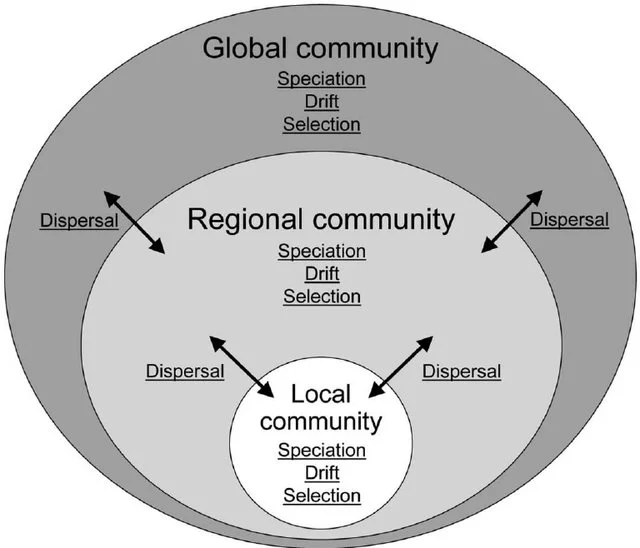
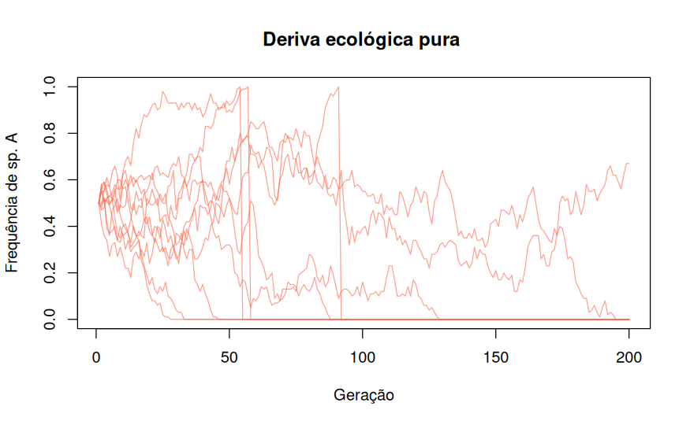
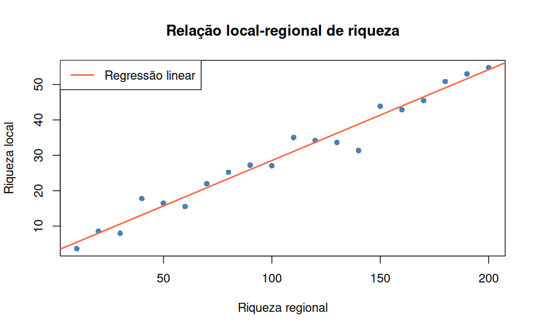
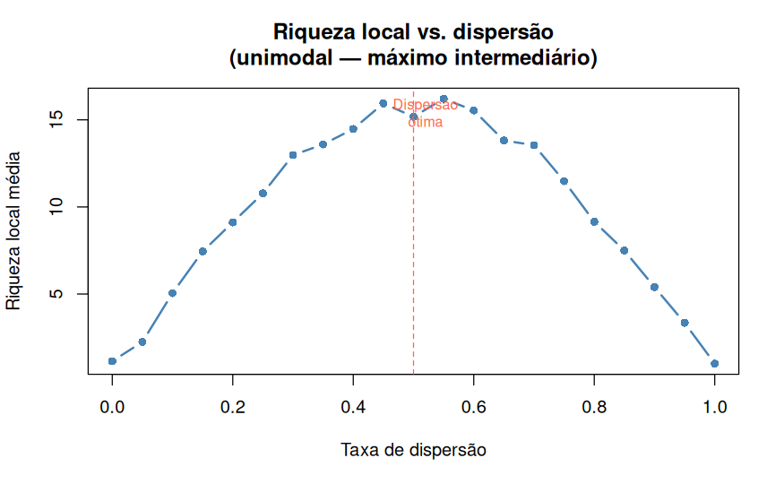
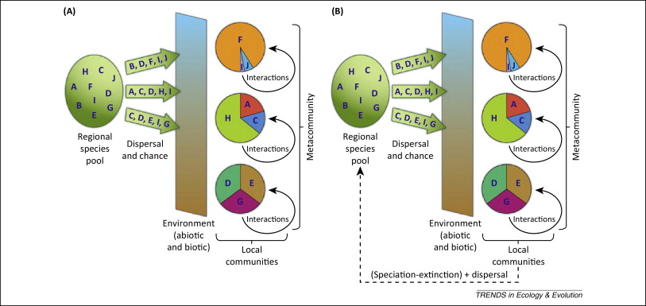
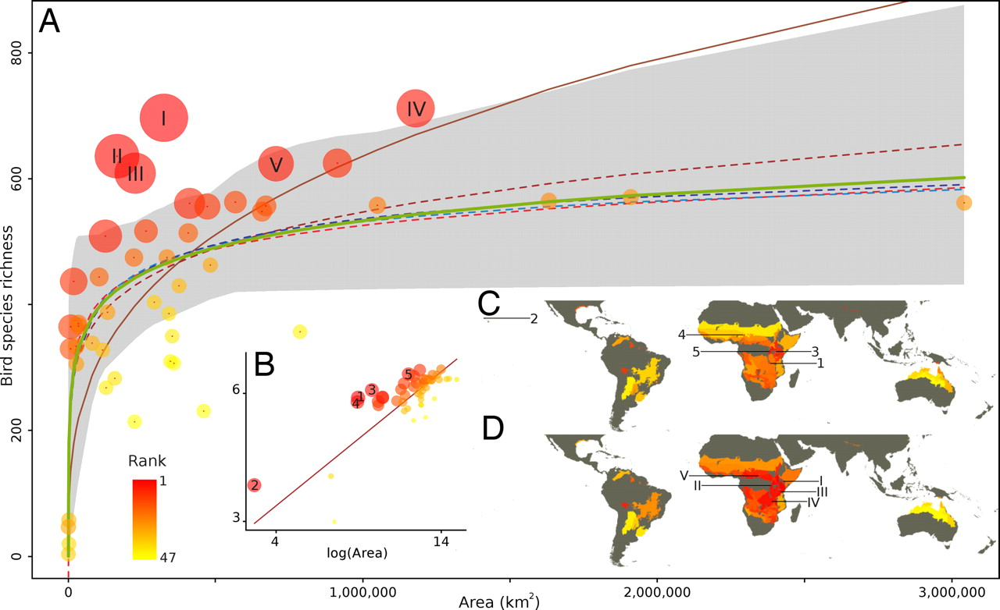
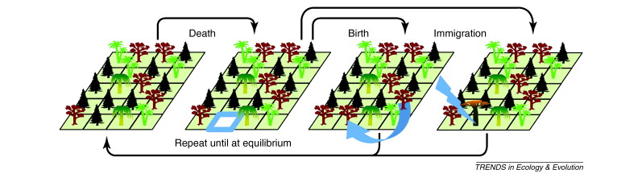
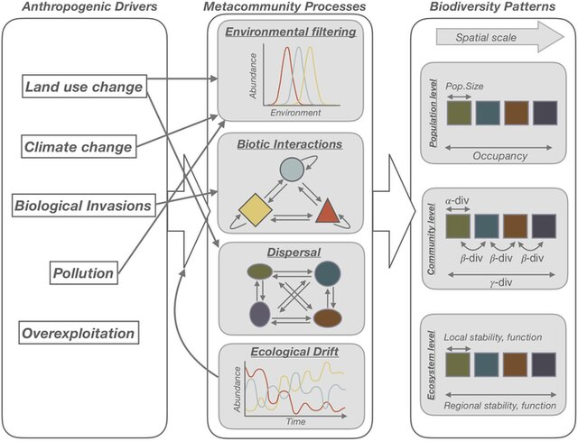

## O que é uma Comunidade Ecológica?

:::: {.columns}

::: {.column width="50%"}
- Conjunto de **populações de diferentes espécies** que coexistem em um local e tempo
- Interagem entre si e com o ambiente
- Apresentam **estrutura** e **organização** próprias
- São **dinâmicas**: mudam ao longo do tempo e espaço

:::

::: {.column width="50%"}
{fig-align="center" width="80%"}
:::

::::

---

## Por que Comparar Comunidades?

:::: {.columns}

::: {.column width="50%"}
- Avaliar **impactos ambientais** e perturbações
- Monitorar **mudanças ao longo do tempo**
- Comparar habitats distintos
- Entender padrões de **biodiversidade**
- Embasar decisões de **conservação**
:::

::: {.column width="50%"}

:::

::::

---

## A Ecologia é uma "Bagunça"

- Na genética de populações:
  - **Seleção** — mudanças nas frequências alélicas
  - **Deriva** — mudanças estocásticas
  - **Mutação** — fonte de nova variação
  - **Fluxo gênico** — entrada/saída de alelos
- [Vellend (2010)](https://www.researchgate.net/publication/44689600_Conceptual_Synthesis_in_Community_Ecology) propõe uma **síntese unificada** da disciplina

---

## Os 4 Processos de Vellend (2010)

| Ecologia de Comunidades | Genética de Populações |
|---|---|
| **Seleção** | Seleção |
| **Deriva** | Deriva genética |
| **Especiação** | Mutação |
| **Dispersão** | Fluxo gênico |

- Esses processos **não são excludentes** — interagem continuamente
- A teoria geral: *espécies entram via especiação e dispersão; abundâncias relativas são moldadas por deriva e seleção*

##

{fig-align=center}

## Processo 1: Seleção 

- **Definição**: diferenças determinísticas de *fitness*
- Três formas principais:
  - **Seleção constante**: uma espécie sempre "ganha"
  - **Seleção dependente da densidade** : favorece coexistência estável
  - **Seleção variável** no espaço/tempo: permite coexistência via *trade-offs*

## Processo 1: Seleção 

{.fragment .absolute fig-align=center}
{.fragment .absolute fig-align=center}

## Processo 2: Deriva Ecológica (*Drift*)

- **Definição**: mudanças **estocásticas** nas abundâncias relativas das espécies
- Hubbell (2001): *Teoria Neutra Unificada* — bases da deriva ecológica
- Importância da deriva aumenta quando:
  - Comunidades são **pequenas**
  - Diferenças de *fitness* entre espécies são **fracas**
  - Distúrbios **reduzem** o tamanho da comunidade

## Processo 2: Deriva Ecológica (*Drift*)

## Processo 3: Especiação

- **Definição**: criação de novas espécies
-   Equivale à **mutação** na genética de populações
- Determina o **pool regional de espécies** (Div Gama)
- *Hipótese do pool de espécies* (Taylor et al. 1990): habitats mais antigos geram mais espécies adaptadas a eles
- Padrões que dependem de especiação:
  - **Beta Diversidade** entre regiões com condições similares
  - **Gradientes de diversidade** com altitude, latitude ou produtividade
  
## Processo 3: Especiação

## Processo 4: Dispersão 

- **Definição**: movimento de organismos no espaço
  - Equivale ao **fluxo gênico** na genética de populações
  - Conecta comunidades locais → **metacomunidades**
- Efeitos da dispersão dependem de sua interação com seleção e deriva:
  - **Dispersão baixa**: deriva domina → comunidades divergem
  - **Dispersão moderada**: riqueza local é **maximizada**
  - **Dispersão alta**: competidores superiores dominam globalmente → riqueza cai

## Processo 4: Dispersão 

## Interações entre os 4 Processos

- Os 4 processos raramente atuam **isoladamente**
- Podem ser combinados de **12 formas** distintas para gerar modelos
  - (especiação e dispersão exigem ao menos seleção **ou** deriva para serem operacionais)
- Exemplos de interações:
  - **Seleção + Deriva**: resultados determinísticos com ruído estocástico
  - **Deriva + Dispersão**: Teoria da Biogeografia de Ilhas (MacArthur & Wilson 1967)
  - **Deriva + Dispersão + Especiação**: Teoria Neutra de Hubbell (2001)
  - **Seleção + Dispersão**: metacomunidades com *species sorting* e *mass effects*
  - **Todos os 4**: teoria geral de comunidades (Vellend 2010)

## Interações entre os 4 Processos

## As 12 Combinações de Processos e Teorias {.scrollable}
:::{.scrollable}

| # | Sel. | Der. | Esp. | Disp. | Teoria / Modelo |
|:-:|:---:|:---:|:---:|:----:|---|
| 1 | ✓ | | | | Modelos de nicho (competição por recursos, predador-presa, teias tróficas) |
| 2 | | ✓ | | | Teoria Neutra I (estocasticidade demográfica) |
| 3 | ✓ | ✓ | | | Modelos nicho-neutro (qualquer modelo de nicho com estocasticidade) |
| 4 | ✓ | | ✓ | | Ecologia histórica I (hipótese do pool, gradientes de diversidade) |
| 5 | | ✓ | ✓ | | Teoria Neutra II (não espacial) |
| 6 | ✓ | | | ✓ | Metacomunidades determinísticas (*mass effects*, teias tróficas espaciais) |
| 7 | | ✓ | | ✓ | Biogeografia de Ilhas (MacArthur & Wilson 1967) |
| 8 | ✓ | ✓ | ✓ | | Ecologia histórica II |
| 9 | ✓ | | ✓ | ✓ | Ecologia histórica III |
| 10 | | ✓ | ✓ | ✓ | Teoria Neutra IV (espacial — Hubbell 2001) |
| 11 | ✓ | ✓ | | ✓ | Metacomunidades estocásticas (*trade-off* colonização-competição) |
| 12 | ✓ | ✓ | ✓ | ✓ | **Teoria geral de comunidades (Vellend 2010)** |

:::

---

## Padrões em Comunidades: A "Caixa Preta"

- Os 4 processos geram padrões amplamente estudados:
  - Relação espécies-área
  - Distribuição de abundâncias relativas
  - Gradiente latitudinal de diversidade
  - Relação diversidade-distância (decaimento de similaridade)
  - Relações diversidade-produtividade e diversidade-distúrbio
  
## Exemplos 
- **Problema central**: a maioria dos padrões tem **múltiplas explicações** possíveis
- Exemplo: relação espécies-área pode ser explicada por **deriva** (extinção menor em ilhas grandes), **dispersão** (maior área = maior alvo), **seleção** (maior heterogeneidade ambiental) e **especiação** (mais oportunidades em ilhas grandes)

## Espécie-Área

## Teoria Neutra de Hubbell (2001)

- Caso especial: **apenas Deriva + Dispersão + Especiação** (sem seleção)
- Pressuposto: todos os indivíduos são **ecologicamente equivalentes** (*neutralidade*)
- Comunidade local determinada por:
  - **Tamanho** da metacomunidade (*J*~M~)
  - **Taxa de especiação** (ν)
  - **Taxa de dispersão** (*m*)
- Contribuição: formalizou a **deriva** como processo legítimo, não apenas "ruído"

## Teoria Neutra de Hubbell (2001)

## Metacomunidades: Dispersão como Eixo Central

- **Metacomunidade**: conjunto de comunidades locais conectadas por dispersão
  - **Neutralidade**: deriva + dispersão (sem seleção)
  - **Dinâmica de patches**: *trade-off* colonização-competição
  - **Filtros**: seleção filtra espécies por gradiente ambiental
  - **Efeitos de massa**: dispersão mantém espécies em habitats desfavoráveis

- **Diversidade beta** é a assinatura espacial das metacomunidades

## Metacomunidades: Dispersão como Eixo Central

## Implicações

- **Para o ensino**: organiza toda a ecologia de comunidades em torno de 4 processos — mais coerente que listagem de padrões e interações
- **Para a pesquisa**: permite **localizar qualquer teoria** na Tabela 2 → evita reinvenção da roda
- **Para aplicações**: conservação e manejo podem ser guiados por identificar qual processo é dominante:
  - Fragmentação → limita **dispersão**
  - Invasões → alteram **seleção**
  - Perda de habitat → intensifica **deriva**
  - Extinções locais → afetam o **pool** via especiação
- Desafio permanente: **inferir processo a partir de padrão** — a "caixa preta" continua

## Resumo

- A ecologia de comunidades tem uma **teoria geral** 
- Os 4 processos são **concomitantes**
- A teoria geral ecoa a **Síntese Moderna** da biologia evolutiva
- Padrões têm **múltiplas causas** — isso não é fraqueza da ecologia, é sua natureza

**Leitura complementar:**

- Vellend (2016). *The Theory of Ecological Communities*. Princeton University Press.
- Hubbell (2001). *The Unified Neutral Theory of Biodiversity and Biogeography*. Princeton.
- Holyoak et al. (2005). *Metacommunities*. University of Chicago Press.

## Fim {.center}