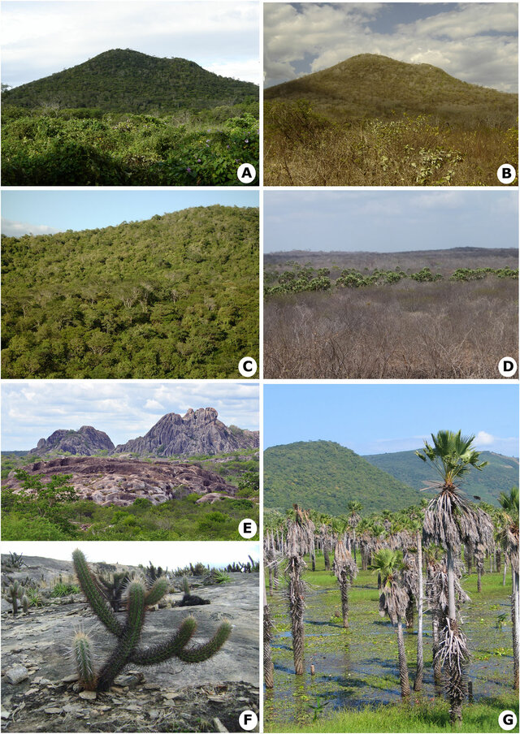
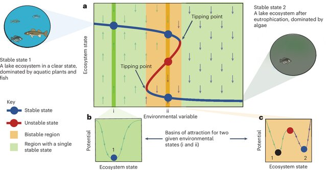

```{=html}
<style>
  .reveal .slides section {
    font-family: 'Segoe UI', Arial, sans-serif;
  }

  .reveal .slides {
    font-size: 0.82em;
  }
  .reveal .slides section {
    font-size: 0.92em;
  }
  .reveal h1 { font-size: 1.7em; }
  .reveal h2 { font-size: 1.35em; }
  .reveal h3 { font-size: 1.15em; }

  .reveal h1, .reveal h2 {
    color: #2C5F2D;
    font-weight: 700;
  }
  .reveal h3 {
    color: #4A8C3F;
  }
  .destaque {
    background: #e8f5e9;
    border-left: 5px solid #2C5F2D;
    padding: 0.6em 1em;
    border-radius: 4px;
    margin: 0.5em 0;
  }
  .autor {
    color: #555;
    font-size: 0.85em;
    font-style: italic;
  }
  .tag {
    display: inline-block;
    background: #2C5F2D;
    color: white;
    border-radius: 12px;
    padding: 2px 12px;
    font-size: 0.75em;
    margin: 2px;
  }
  .tag-r { background: #c0392b; }
  .tag-k { background: #1a5276; }
  .tag-s { background: #6c3483; }
  .tag-c { background: #784212; }
  .grid-2 {
    display: grid;
    grid-template-columns: 1fr 1fr;
    gap: 1.2em;
  }
  .grid-3 {
    display: grid;
    grid-template-columns: 1fr 1fr 1fr;
    gap: 1em;
  }
  .card {
    background: #f4f9f4;
    border: 1px solid #a5d6a7;
    border-radius: 8px;
    padding: 0.8em;
  }
  .card-dark {
    background: #2C5F2D;
    color: white;
    border-radius: 8px;
    padding: 0.8em;
  }
  .card-dark h4 { color: #a5d6a7; margin-top: 0; }
  .card h4 { color: #2C5F2D; margin-top: 0; }
  .bioma {
    font-weight: bold;
    color: #1b5e20;
  }
  .numero-grande {
    font-size: 2.5em;
    font-weight: bold;
    color: #2C5F2D;
    line-height: 1;
  }
  .seta { color: #2C5F2D; font-size: 1.4em; font-weight: bold; }
  table {
    font-size: 0.82em;
    width: 100%;
  }
  th { background: #2C5F2D; color: white; padding: 6px 10px; }
  td { padding: 5px 10px; border-bottom: 1px solid #ddd; }
  tr:nth-child(even) td { background: #f1f8e9; }
</style>
```

## O que é Sucessão Ecológica?

::: {.destaque}
**Sucessão ecológica** é o processo direcional e contínuo de mudança na composição de espécies e estrutura de uma comunidade ao longo do tempo, em resposta a modificações no ambiente biótico e abiótico.
:::

<div class="grid-2" style="margin-top:1em;">
<div class="card">
<h4>🌱 Processo</h4>
- Colonização → Estabelecimento → Competição → Substituição
- Gradual e previsível (em parte)
- Mudanças em diversidade, biomassa e estrutura
</div>
<div class="card">
<h4>🔑 Por que estudar?</h4>
- Restauração ecológica
- Conservação de biomas
- Respostas a distúrbios naturais e antrópicos
- Manejo de paisagens
</div>
</div>

---

# Módulo 1 {background-color="#1b5e20"}

## Montagem de Comunidades Ecológicas

**Gleason vs. Clements**

---

## Visão Clementsiana — A Comunidade como Superorganismo

<div class="grid-2">
<div>
**Frederic Clements (1916)**

- Comunidades são **entidades discretas e integradas**, análogas a organismos
- Espécies coexistem porque evoluíram juntas — alta **interdependência**
- Sucessão é determinística: o **clímax** é o estado final estável ditado pelo clima
- Comunidades climácicas são **repetíveis e previsíveis**

::: {.destaque}
O clímax climático da Floresta Amazônica seria o destino inevitável para qualquer área perturbada na região.
:::
</div>
<div class="card-dark" style="margin-top:1em;">
<h4>📌 Modelo Clementsiano</h4>

**Perturbação**  
↓  
Espécies pioneiras  
↓  
Séries de substituição  
↓  
**Clímax climático** ← ponto fixo determinado pelo clima regional

<br>
<span style="font-size:0.85em; color:#c8e6c9;">Previsível · Determinístico · Holístico</span>
</div>
</div>

---

## Visão Gleasoniana — O Individualismo das Espécies

<div class="grid-2">
<div>
**Henry Gleason (1926)**

- Cada espécie responde **individualmente** ao ambiente — não em bloco
- Comunidades são **encontros fortuitos** de espécies com nichos compatíveis
- Sem entidade supraorganísmica; sem clímax único
- A composição local depende de: **dispersão, histórico de distúrbios, acaso**

::: {.destaque}
Na Caatinga, a composição de espécies varia enormemente entre fragmentos a poucos km de distância — reflexo do individualismo gleasoniano.
:::
</div>
<div>



</div>
</div>

## Comparativo entre as visões

<div class="grid-2">
<div>

<br>

| Aspecto | Clements | Gleason |
|---------|----------|---------|
| Comunidade | Superorganismo | Assembleia casual |
| Sucessão | Determinística | Estocástica |
| Clímax | Único e fixo | Múltiplos/variável |
| Espécies | Interdependentes | Independentes |
| Previsibilidade | Alta | Baixa |

</div>
<div>


</div>
</div>


---

## Síntese Moderna: Filtros de Montagem

A ecologia contemporânea integra ambas as visões através do conceito de **filtros de montagem** (Assembly Rules):

<div class="grid-3" style="margin-top:1em;">
<div class="card">
<h4>🌍 Filtro Abiótico</h4>
Clima, solo, água, topografia filtram o pool regional de espécies
<br><br>
<span class="bioma">Ex.: solos hidromórficos do Pantanal excluem espécies não tolerantes a inundação</span>
</div>
<div class="card">
<h4>🐾 Filtro Biótico</h4>
Competição, predação, mutualismo e facilitação determinam quem persiste
<br><br>
<span class="bioma">Ex.: herbivoria de grandes mamíferos no Cerrado molda composição de gramíneas</span>
</div>
<div class="card">
<h4>🎲 Filtro de Dispersão</h4>
Limitação de dispersão e acaso histórico completam a montagem
<br><br>
<span class="bioma">Ex.: rios como barreiras de dispersão na Amazônia — hipótese dos rios</span>
</div>
</div>

::: {.destaque}
**Pool Regional** → Filtro Abiótico → Filtro de Dispersão → Filtro Biótico → **Comunidade Local**
:::

---

# Módulo 2 {background-color="#1b5e20"}

## Estratégias de Regeneração

**r vs. K e Triângulo CSR**

---

## Estratégias r e K — Teoria da Seleção de História de Vida

<div class="grid-2">
<div>
**MacArthur & Wilson (1967) | Pianka (1970)**

**Espécies r-estrategistas**
- Ambientes instáveis/perturbados
- Alta taxa de reprodução, baixa longevidade
- Pequeno porte, desenvolvimento rápido
- Baixa competitividade

**Espécies K-estrategistas**
- Ambientes estáveis/tardios
- Baixa fecundidade, alta longevidade
- Grande porte, maturação lenta
- Alta competitividade por recursos
</div>
<div>

```
SUCESSÃO
Pioneiro ───────────────► Clímax

r ←─────────────────────► K

• Embaúba           • Castanheira
  (Cecropia spp.)     (Bertholletia excelsa)
  
• Vassourinha        • Jatobá
  (Baccharis spp.)    (Hymenaea courbaril)
  
• Capim-colonião     • Angico
  (Megathyrsus max.)  (Anadenanthera spp.)
```

::: {.destaque}
No Cerrado, *Kielmeyera coriacea* (pau-santo) é K-estrategista com bulbos subterrâneos que suportam décadas de rebrota pós-fogo.
:::
</div>
</div>

---

## Triângulo CSR de Grime

**J.P. Grime (1977)** — três estratégias primárias em função de **estresse** e **distúrbio**:

<div class="grid-3" style="margin-top:0.8em;">
<div class="card">
<h4><span class="tag tag-c">C</span> Competidoras</h4>
- Baixo estresse, baixo distúrbio
- Crescimento rápido quando recursos abundam
- Alta aquisição de recursos
- **Ex.:** *Cedrela odorata* (cedro) — Floresta Atlântica
</div>
<div class="card">
<h4><span class="tag tag-s">S</span> Tolerantes ao Estresse</h4>
- Alto estresse, baixo distúrbio
- Crescimento lento, alta conservação de recursos
- Longevidade elevada
- **Ex.:** *Vellozia compacta* — campo rupestre
</div>
<div class="card">
<h4><span class="tag tag-r">R</span> Ruderais</h4>
- Baixo estresse, alto distúrbio
- Ciclo de vida curto, alta reprodução
- Colonização rápida
- **Ex.:** *Solanum mauritianum* — clareiras Mata Atlântica
</div>
</div>

::: {.destaque style="margin-top:0.8em;"}
Espécies reais ocupam posições **intermediárias** no triângulo (CS, SR, CR, CSR) — o modelo é contínuo, não categórico.
:::

---

## CSR em figura

{fig-align=center}

---

## Módulo 3 Sucessão Primária e Secundária {background-color="#1b5e20".center}


## Sucessão Primária — Colonização do Zero

::: {.destaque}
**Sucessão primária** ocorre em substratos que nunca foram colonizados ou foram totalmente desprovidos de vida e solo — ausência de banco de sementes e de legado biótico.
:::

<div class="grid-2" style="margin-top:0.8em;">
<div>
**Etapas clássicas:**

1. **Substrato nu** — rocha, lava, dunas recentes
2. **Liquens e briófitas** — intemperismo físico-químico
3. **Herbáceas pioneiras** — acúmulo de matéria orgânica
4. **Arbustos** — sombreamento parcial
5. **Floresta** — fechamento do dossel
</div>
<div>

**Exemplos brasileiros:**

🌋 **Ilhas vulcânicas** — Trindade e Martim Vaz: colonização por *Cyperus* e fetos pioneiros sobre basalto exposto

🏖️ **Dunas costeiras** — Lençóis Maranhenses: sequência pioneira com *Ipomoea pes-caprae* → *Sophora tomentosa* → arbustos de restinga

🪨 **Inselbergs** — afloramentos rochosos no Nordeste: criptógamas → *Sedum* → vegetação rupícola
</div>
</div>

---

## Sucessão Secundária — Regeneração Após Distúrbio

::: {.destaque}
**Sucessão secundária** ocorre onde houve uma comunidade prévia — banco de sementes, raízes, matéria orgânica e estrutura de solo permanecem, acelerando o processo.
:::

<div class="grid-3" style="margin-top:0.8em;">
<div class="card">
<h4>⚡ Fase Pioneira (0–5 anos)</h4>
Herbáceas, cipós e arbustos heliófilos colonizam rapidamente
<br><br>


Ex.: *Cecropia*, *Trema*, *Piper* em clareiras amazônicas
</div>
<div class="card">
<h4>🌿 Fase Inicial (5–20 anos)</h4>
Árvores pioneiras formam dossel inicial; sombreamento exclui herbáceas
<br><br>
{width =70%}
Ex.: *Schizolobium parahyba* (guapuruvu) na Mata Atlântica
</div>
<div class="card">
<h4>🌳 Fase Avançada (20+ anos)</h4>
Espécies tolerantes à sombra recrutam sob o dossel; diversidade aumenta
<br><br>

Ex.: *Euterpe oleracea*, *Eschweilera* spp. na Amazônia
</div>
</div>

---

## Primária vs. Secundária — Comparação

<div class="grid-2">
<div>

| Característica | Primária | Secundária |
|----------------|----------|------------|
| Substrato | Sem solo/biota | Solo pré-existente |
| Velocidade | Muito lenta | Mais rápida |
| Banco de sementes | Ausente | Presente |
| Facilitação | Essencial | Moderada |
| Fator limitante | Nutrientes, substrato | Luz, competição |
| Duração estimada | Séculos-milênios | Décadas-século |
| Exemplo | Dunas de Lençóis | Pasto abandonado no Cerrado |

</div>
<div class="card-dark">
<h4>📊 Velocidade de Recuperação — Mata Atlântica</h4>

Pasto abandonado → floresta secundária:

- **5 anos:** dossel de 8–12m com *Cecropia*
- **15 anos:** 50–60% de cobertura de espécies originais
- **30 anos:** estrutura florestal presente; diversidade ~40% da primária
- **80–100 anos:** difícil distinguir de floresta madura pela estrutura

Porém: **espécies raras e lianas tardias levam 200+ anos** para retornar.
</div>
</div>

---

# Módulo 4 - Distúrbio e Sucessão Ecológica {background-color="#1b5e20"}


---

## O Conceito de Distúrbio

::: {.destaque}
**Distúrbio**: evento discreto no tempo que perturba a estrutura de ecossistemas, comunidades ou populações e altera recursos, disponibilidade de substrato ou ambiente físico.
:::

<div class="grid-3" style="margin-top:0.8em;">
<div class="card">
<h4>🔥 Intensidade</h4>
Grau de destruição da biomassa e estrutura do solo
<br><br>
Baixa: queda de uma árvore<br>
Alta: incêndio de grandes proporções
</div>
<div class="card">
<h4>📅 Frequência</h4>
Intervalo entre distúrbios sucessivos
<br><br>
Alta: campos sazonais<br>
Baixa: florestas de terra firme
</div>
<div class="card">
<h4>📐 Extensão</h4>
Área afetada pelo evento
<br><br>
Pequena: clareiras<br>
Grande: queimadas de savanas
</div>
</div>

---

## Hipótese do Distúrbio Intermediário (HDI)

**Connell (1978):** a diversidade de espécies é maximizada em regimes de **distúrbio intermediário** — nem muito raros nem muito frequentes.

<div class="grid-2" style="margin-top:0.8em;">
<div>

```{r}
# Instale os pacotes se necessário: install.packages(c("ggplot2", "tibble"))
library(ggplot2)
library(tibble)

# 1. Criando os dados simulados para a curva
# Usamos uma função quadrática invertida para gerar a parábola perfeita
dados <- tibble(
  disturbio = seq(0, 10, length.out = 100),
  diversidade = -0.2 * (disturbio - 5)^2 + 6
)

# 2. Criando o gráfico com ggplot2
ggplot(dados, aes(x = disturbio, y = diversidade)) +
  # Linha da hipótese
  geom_line(color = "#2c3e50", size = 1.2) +
  
  # Sombreamento sob a curva para efeito estético (opcional)
  geom_area(fill = "#3498db", alpha = 0.1) +
  
  # Customização dos eixos (padrão conceitual, sem números)
  scale_x_continuous(breaks = c(1, 5, 9), labels = c("Baixo", "Intermediário", "Alto")) +
  scale_y_continuous(breaks = NULL) + # Remove números do eixo Y já que é conceitual
  
  # Títulos e Rótulos
  labs(
    title = "Hipótese do Distúrbio Intermediário (HDI)",
    subtitle = "A diversidade de espécies é maximizada em níveis intermediários de perturbação",
    x = "Frequência / Intensidade do Distúrbio",
    y = "Diversidade de Espécies (Riqueza)"
  ) +
  
  # Anotações conceituais no gráfico
  annotate("text", x = 1, y = 1.5, label = "Exclusão\nCompetitiva", color = "#7f8c8d", fontface = "italic", size = 3.5) +
  annotate("text", x = 5, y = 5.5, label = "Pico de\nDiversidade", color = "#27ae60", fontface = "bold", size = 4) +
  annotate("text", x = 9, y = 1.5, label = "Alta\nMortalidade", color = "#c0392b", fontface = "italic", size = 3.5) +
  
  # Tema visual limpo
  theme_minimal(base_size = 14) +
  theme(
    plot.title = element_text(face = "bold", color = "#2c3e50", hjust = 0.5),
    plot.subtitle = element_text(color = "#7f8c8d", hjust = 0.5, size = 11),
    axis.title = element_text(face = "bold"),
    panel.grid.major = element_line(color = "#f0f3f4"),
    panel.grid.minor = element_blank()
  )
```


- **Baixo distúrbio:** competidores excluem espécies
- **Intermediário:** diversidade máxima
- **Alto distúrbio:** só espécies ruderais sobrevivem
</div>
<div>

**Evidências brasileiras:**

🌿 **Florestas com clareias naturais** — Floresta Amazônica mantém alta diversidade beta pelo regime de queda de árvores (0,5–2% da área/ano)

🔥 **Cerrado** — experimentos em Brasília mostram que fogo a cada 3–5 anos maximiza riqueza de gramíneas e herbáceas; fogo anual ou ausência de fogo reduzem diversidade

🌊 **Várzeas** — pulso de inundação amazônico como distúrbio intermediário chave para diversidade de peixes e macrófitas
</div>
</div>

---

## Distúrbios nos Biomas Brasileiros

<div class="grid-2">
<div>

**Distúrbios naturais:**

| Bioma | Distúrbio principal | Frequência |
|-------|---------------------|------------|
| Amazônia | Quedas de árvores, cheias | Contínuo |
| Cerrado | Fogo (relâmpago) | 2–5 anos |
| Pantanal | Inundação sazonal | Anual |
| Caatinga | Seca extrema | Irregular |
| Mata Atlântica | Deslizamentos, ventos | Décadas |
| Campos Sulinos | Geada, granizo | Anual |

</div>
<div class="card-dark">
<h4>⚠️ Distúrbios antrópicos e sucessão</h4>

**Desmatamento na Amazônia:**
- Corte seletivo → fragmentação → efeito de borda
- Retarda ou impede sucessão secundária por:
  - Degradação do banco de sementes
  - Perda de dispersores (aves, morcegos)
  - Solo compactado por maquinário
  - "Savanização" com gramíneas exóticas

**Consequência:** Em áreas com perturbações sucessivas, a floresta secundária **não consegue se reestabelecer** sem intervenção ativa de restauração.
</div>
</div>

---

## Ecologia de Clareiras — Distúrbio em Escala Fina

<div class="grid-2">
<div>

**Clareiras (treefall gaps)** são a unidade básica de renovação florestal:

- **Área:** 20–500 m² (típico)
- **Frequência:** 0,5–2% da área florestal/ano
- Criam **mosaico** de patches em diferentes estágios


</div>
<div>

**Diferenças por tamanho de clareira:**

| Tamanho | Colonizadores | Resultado |
|---------|---------------|-----------|
| < 50 m² | Sub-bosque | Regeneração local rápida |
| 50–200 m² | Pioneiras mistas | Diversidade intermediária |
| > 200 m² | Heliófitas obrigadas | Alta biomassa pioneira |

::: {.destaque}
Clareiras grandes (> 200 m²) na Floresta Atlântica são colonizadas preferencialmente por *Cecropia glaziovii* e *Piper* spp., gerando alta heterogeneidade espacial.
:::
</div>
</div>

---

# Módulo 5 - Ecologia Funcional e Sucessão {background-color="#1b5e20"}


---

## Traços Funcionais e Dinâmica Sucessional

::: {.destaque}
**Ecologia funcional** estuda como os **traços das espécies** (morfológicos, fisiológicos, comportamentais) determinam sua resposta ao ambiente e seu efeito sobre processos ecossistêmicos.
:::

<div class="grid-3" style="margin-top:0.8em;">
<div class="card">
<h4>🍃 Traços Foliares</h4>
- **SLA** (Área foliar específica)
- **LDMC** (teor de matéria seca)
- Concentração de N e P
- Espessura da folha
</div>
<div class="card">
<h4>🌲 Traços de Porte</h4>
- Altura máxima
- Densidade da madeira
- Diâmetro do tronco
- Espessura da casca
</div>
<div class="card">
<h4>🌰 Traços Reprodutivos</h4>
- Massa da semente
- Síndrome de dispersão
- Idade de primeira reprodução
- Fecundidade
</div>
</div>

---

## Gradientes Funcionais ao Longo da Sucessão

<div class="grid-2">
<div>

**Espécies pioneiras → tardias:**

| Traço | Pioneiras | Tardias |
|-------|-----------|---------|
| SLA | Alto (folhas finas) | Baixo (esclerófilas) |
| Densidade da madeira | Baixa | Alta |
| Massa da semente | Pequena | Grande |
| Crescimento | Rápido | Lento |
| Tolerância à sombra | Baixa | Alta |
| Dispersão | Anemocoria/zoocoria pequena | Zoocoria grande |

</div>
<div>

::: {.destaque}
**Gradiente exploração → conservação de recursos (Díaz et al. 2016)**

O "espectro econômico foliar" organiza espécies em um eixo de aquisição rápida (*fast*) a conservação (*slow*) de recursos — padrão universal, incluindo florestas tropicais brasileiras.
:::


</div>
</div>

---

## Diversidade Funcional e Estabilidade Ecossistêmica

<div class="grid-2">
<div>

**Por que a diversidade funcional importa na sucessão?**

- **Redundância funcional:** múltiplas espécies com mesmo papel → resiliência
- **Complementaridade:** diferentes nichos = melhor uso dos recursos
- **Efeito de amostrador:** espécies dominantes determinam função do ecossistema

**Durante a sucessão:**
- Fases iniciais: **baixa** diversidade funcional (poucas estratégias)
- Fases intermediárias: **alta** diversidade funcional
- Fases tardias: **diversidade** estrutural alta, funcional moderada (convergência)
</div>
<div class="card-dark">
<h4>📌 Caso: Diversidade Funcional no Cerrado</h4>

Estudos em áreas com diferentes históricos de fogo no Cerrado de Brasília mostram que:

- **Cerrado com fogo intermediário** tem maior diversidade funcional de gramíneas (traços: altura, SLA, aerênquima)

- **Cerrado sem fogo** tende à dominância de poucas espécies lenhosas C-estrategistas

- **Fogo frequente** seleciona fortemente por traços de rebrota (geófitos, xilopódios)

→ **Regime de fogo = filtro funcional de primeira ordem**
</div>
</div>

---

## Facilitação e Inibição na Perspectiva Funcional

<div class="grid-3" style="margin-top:0.8em;">
<div class="card">
<h4>✅ Facilitação</h4>
Espécies pioneiras **melhoram o ambiente** para sucessores
<br><br>
Ex.: Leguminosas fixadoras de N₂ (*Inga*, *Mimosa*) aumentam fertilidade do solo na Mata Atlântica secundária, acelerando estabelecimento de tardias
</div>
<div class="card">
<h4>🚫 Inibição</h4>
Espécies estabelecidas **resistem** à invasão por sucessores
<br><br>
Ex.: Gramíneas africanas (*Urochloa* spp.) em áreas de Cerrado degradado inibem regeneração de lenhosas por competição intensa e promoção de fogo
</div>
<div class="card">
<h4>🔄 Tolerância</h4>
Sucessores crescem **lentamente** sob o dossel dos pioneiros até superá-los
<br><br>
Ex.: Palmeiras (*Euterpe edulis*) germinam no sub-bosque e crescem durante décadas até atingir o dossel na Mata Atlântica
</div>
</div>

---

## Síntese: Teoria e Padrões de Biomas Brasileiros

<div class="grid-2">
<div>

**Gradientes-chave que modulam a sucessão no Brasil:**

| Gradiente | Efeito na sucessão |
|-----------|-------------------|
| Precipitação | Velocidade e complexidade |
| Sazonalidade | Caducifolia vs. perenifólia |
| Fogo | Fisionomia e traços funcionais |
| Fertilidade do solo | Biomassa e diversidade |
| Altitude | Composição florística |
| Fragmentação | Disponibilidade de propágulos |

</div>
<div>

**Convergências teóricas:**

::: {.destaque}
🌿 **Gleason vence Clements** no detalhe — mas filtros abióticos fortes (seca, fogo, inundação) criam previsibilidade clementsiana em escala regional.

🔄 **CSR + r/K** são complementares: r/K descreve o eixo ciclo de vida; CSR adiciona o eixo estresse.

🔥 **Distúrbio intermediário** explica a alta diversidade dos biomas — Cerrado e Amazônia são sistemas mantidos longe do equilíbrio.
:::
</div>
</div>

---

## Restauração Ecológica como Sucessão Dirigida

<div class="grid-3">
<div class="card">
<h4>🌱 Nucleação</h4>
Criar pontos de atração para fauna dispersora (poleiros artificiais, plantio em ilhas)
<br><br>
Acelera colonização natural ao redor do núcleo — eficaz na Mata Atlântica e Cerrado
</div>
<div class="card">
<h4>🌳 Plantio em modelos mistos</h4>
Combinar espécies de diferentes grupos funcionais (pioneiras + tardias)
<br><br>
Modelo CERNE/ESALQ: 30% pioneiras + 70% tardias em Mata Atlântica
</div>
<div class="card">
<h4>🔬 Restauração Funcional</h4>
Selecionar espécies por **traços funcionais** para garantir processos ecossistêmicos
<br><br>
Não apenas diversidade de espécies, mas de funções (polinizadores, dispersores, fixadores de N)
</div>
</div>

::: {.destaque style="margin-top:0.8em;"}
**Meta do PACTO PELA RESTAURAÇÃO DA MATA ATLÂNTICA e Plano ABC+:** restaurar 15 milhões de hectares até 2030 — a maior iniciativa de restauração tropical do mundo.
:::

---

## Desafios Contemporâneos

<div class="grid-2">
<div>

**Mudanças climáticas e sucessão:**

- Alteração do regime de chuvas → mudança nas trajetórias sucessionais
- Aumento da frequência de secas extremas na Amazônia (2005, 2010, 2015–16, 2023)
- **"Savaneização" da Amazônia:** modelo de Lovejoy & Nobre prevê ponto de inflexão entre 20–25% de desmatamento (já próximo em algumas regiões)

**Espécies exóticas invasoras:**
- *Urochloa* spp. bloqueiam sucessão secundária em 50+ milhões ha no Brasil
- *Hovenia dulcis* (uva-do-japão) invade sucessão tardia no Sul
- Pirófitas exóticas alteram regime de fogo no Cerrado

</div>
<div class="card-dark">
<h4>🌡️ Novos estados alternativos estáveis</h4>

A teoria dos **estados alternativos estáveis** é central para entender os biomas brasileiros sob pressão:


</div>
</div>

---

## Perspectivas e Fronteiras de Pesquisa

<div class="grid-3">
<div class="card">
<h4>🧬 Ecologia Molecular</h4>
Metagenômica do solo para rastrear mudanças em comunidades microbianas durante a sucessão
<br><br>
Fungos micorrízicos como indicadores de estágio sucessional
</div>
<div class="card">
<h4>🛰️ Sensoriamento Remoto</h4>
Mapeamento de traços funcionais por espectroscopia hiper-espectral (AVIRIS, DESIS)
<br><br>
Monitoramento de sucessão em larga escala pela variação de índices espectrais
</div>
<div class="card">
<h4>🤖 Modelos de Vegetação</h4>
Modelos dinâmicos de vegetação global (TRIFFID, JSBACH, ED2) integram traços funcionais para projetar sucessão sob cenários climáticos futuros
</div>
</div>

::: {.destaque style="margin-top:0.8em;"}
**Pergunta central:** Em um planeta em rápida mudança, a sucessão ecológica ainda converge para clímaxes reconhecíveis — ou os biomas brasileiros entrarão em trajetórias sem análogos históricos?
:::

---

## Conceitos-Chave para Revisão

<div class="grid-2">
<div>

**Glossário essencial:**

- **Facilitação / Inibição / Tolerância** — modelos de substituição de espécies
- **Traços funcionais** — características que mediam resposta e efeito das espécies
- **Pool regional de espécies** — conjunto disponível para colonização
- **Filtros de montagem** — abiótico, biótico, dispersão
- **Estados alternativos estáveis** — múltiplos equilíbrios possíveis
- **Redundância funcional** — resiliência via diversidade de funções
- **Clímax** vs. **estado dinâmico** — visões antigas vs. modernas
- **Distúrbio intermediário** — maximização da diversidade

</div>
<div>

**Perguntas reflexivas:**

1. Por que o modelo de Clements ainda é útil mesmo que "errado"?
2. Como a teoria CSR e r/K se complementam?
3. O fogo no Cerrado é um distúrbio ou um componente constitutivo?
4. Por que a sucessão secundária amazônica pode ser mais lenta que a primária em algumas condições?
5. Como traços funcionais podem guiar a seleção de espécies para restauração?
6. O que os estados alternativos estáveis implicam para a conservação do Cerrado?

</div>
</div>

---

# Obrigado! {background-color="#2C5F2D"}

<div style="color:white; font-size:1.1em; margin-top:1.5em;">
**Sucessão Ecológica nos Biomas Brasileiros**
</div>


<div style="margin-top:2em; color:#c8e6c9; font-size:0.9em;">

🌿 Montagem de Comunidades  
🔄 Estratégias r/K e CSR  
🌱 Sucessão Primária e Secundária  
🔥 Distúrbio e Diversidade  
🧬 Ecologia Funcional  
🇧🇷 Amazônia · Cerrado · Mata Atlântica · Caatinga · Pantanal · Pampa

</div>
