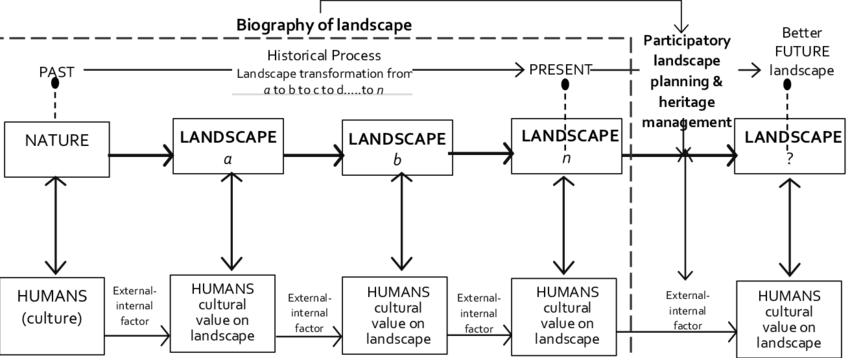
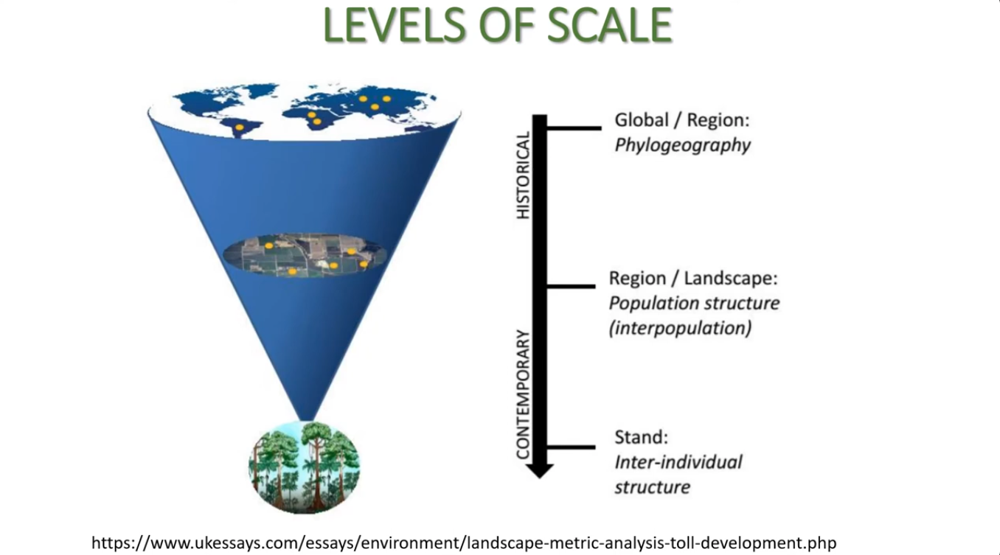
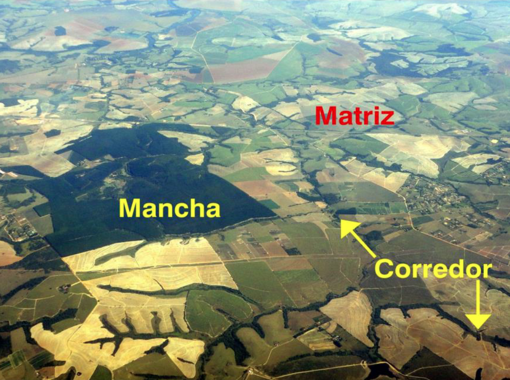

## O que veremos hoje?

- A união entre Geografia e Ecologia.
- A evolução histórica (Carl Troll às escolas modernas).
- O que define uma "Paisagem" para a ciência.
- O novo paradigma: A Heterogeneidade Espacial.

---

## O "Nascimento" da Disciplina

:::{.columns}
:::{.column}

- **Termo:** *Landschaftsökologie* (Ecologia de Paisagem).
- **Autor:** Carl Troll (Geógrafo alemão), 1939.
- **Contexto:**  interpretação de fotografias aéreas.
- **A sacada:** Unir a análise **espacial** da Geografia com a análise **funcional** (ecossistêmica) da Biologia.
:::
:::{.column}
{width="50%"}
:::
:::

---

## Por que o espaço importa?

- A ecologia tradicional muitas vezes tratava o ambiente como um "ponto" no mapa.
- **Problema:** Ignorava que o que acontece "aqui" depende do que existe "ao redor".
- **Exemplo:** Uma floresta cercada por soja funciona diferente de uma floresta cercada por pasto ou cidade.

---

---

## As Duas Grandes Escolas

| Característica | Escola Europeia | Escola Estadunidense |
| :--- | :--- | :--- |
| **Foco** | Geográfico / Social | Biológico / Quantitativo |
| **Abordagem** | Multidisciplinar (Gestão) | Teórica (Modelagem) |
| **Papel Humano** | Homem como parte da paisagem | Homem como agente de distúrbio |

---

## Escola Européia

[Damayanti et al (2015)](https://www.researchgate.net/publication/320433289_The_Cultural_Biography_of_Landscape_As_An_Interdisciplinary_Tool_For_Landscape_Planning_At_Banjarmasin_City_South_Kalimantan_Province_Indonesia)

---

## Escola Estadunidense

Figura: Exemplos de métricas físicas da paisagem

---

## O que é Paisagem? (Definição 1)

> "Uma área de terra heterogênea composta por um grupo de ecossistemas em interação que se repete de forma semelhante por toda a sua extensão."
> — *Forman & Godron (1986)*

**Elementos chave:**

1. **Heterogeneidade** (não é uniforme).

2. **Interação** (fluxos de energia/espécies).

3. **Padrão repetitivo**.

---

---

## O que é Paisagem? (Definição 2)

### A Visão "Organismo-Dependente"
- A paisagem não tem um tamanho fixo "humano".
- Ela é definida pelo **observador** (espécie-alvo).
- **Exemplo:** A paisagem de um besouro (metros) vs. a paisagem de uma onça (quilômetros).

---

---

## O Paradigma da Heterogeneidade

- **Antigo Paradigma:** Sistemas em equilíbrio e fechados.
- **Novo Paradigma (Paisagem):** - Sistemas abertos e dinâmicos.
    - O espaço é descontínuo.
    - A **configuração espacial** (o "layout") dita as regras do jogo ecológico.

---

## O Modelo Mancha-Corredor-Matriz

- **Mancha (Patch):** Área de habitat (ex: fragmento de mata).
- **Corredor (Corridor):** Faixa linear que conecta manchas.
- **Matriz (Matrix):** O elemento dominante e mais conectado (ex: o "mar" de pastagem).

---

---

## Atividade Dirigida (Ficha de Leitura)

**Com base no texto de Metzger (2001), responda:**

1. Explique a principal diferença entre a Escola Europeia e a Estadunidense
2. Por que a disciplina não é apenas "Ecologia de Fragmentos"?
3. Como a escala espacial muda a estratégia de conservação de diferntes organismos?

---

## Próximos Passos

- **Leitura Obrigatória:** Metzger (2001) - *O que é Ecologia de Paisagens?*
- **Software:** Instalar R e RStudio para a Unidade III.
- **Reflexão:** Como a escala de observação muda nossa visão sobre o desmatamento?